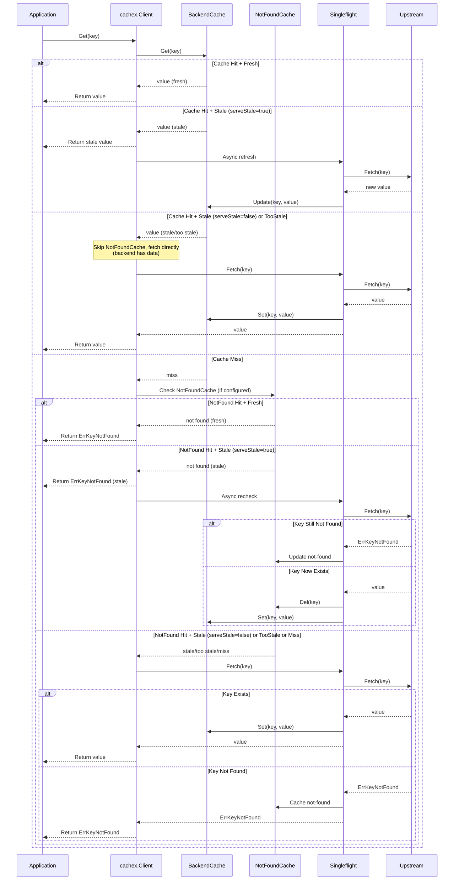

# Cachex

> A high-performance, feature-rich Go caching library with generics, layered caching, and serve-stale mechanism.

[](https://pkg.go.dev/github.com/theplant/cachex)
[](https://goreportcard.com/report/github.com/theplant/cachex)
[](LICENSE)

[English](README.md) | [中文文档](README_ZH.md)

## Features

- **🛡️ Cache Stampede Protection** - Singleflight mechanism merges concurrent requests, preventing traffic surge when hot keys expire
- **🚫 Cache Penetration Defense** - Not-Found caching mechanism prevents malicious queries from overwhelming the database
- **🔄 Serve-Stale** - Serves stale data while asynchronously refreshing, ensuring high availability and low latency
- **🎪 Layered Caching** - Flexible multi-level caching (L1 Memory + L2 Redis), Client can also be used as upstream
- **🚀 High Performance** - Sub-microsecond latency, 79x~1729x throughput amplification, zero error rate
- **🎯 Type-Safe** - Go generics provide compile-time type safety, avoiding runtime type errors
- **⏱️ Flexible TTL** - Independent fresh and stale TTL configuration for precise data lifecycle control
- **🔧 Extensible** - Clean interface design makes it easy to implement custom cache backends

## Quick Start

### Installation

```bash
go get github.com/theplant/cachex
```

### Basic Example

```go
package main

import (
    "context"
    "fmt"
    "time"

    "github.com/theplant/cachex"
)

type Product struct {
    ID    string
    Name  string
    Price int64
}

func main() {
    // Create data cache
    cacheConfig := cachex.DefaultRistrettoCacheConfig[*cachex.Entry[*Product]]()
    cacheConfig.TTL = 30 * time.Second // 5s fresh + 25s stale
    cache, _ := cachex.NewRistrettoCache(cacheConfig)
    defer cache.Close()

    // Create not-found cache
    notFoundConfig := cachex.DefaultRistrettoCacheConfig[time.Time]()
    notFoundConfig.TTL = 6 * time.Second // 1s fresh + 5s stale
    notFoundCache, _ := cachex.NewRistrettoCache(notFoundConfig)
    defer notFoundCache.Close()

    // Define upstream data source
    upstream := cachex.UpstreamFunc[*cachex.Entry[*Product]](
        func(ctx context.Context, key string) (*cachex.Entry[*Product], error) {
            // Fetch from database or API
            // Return cachex.ErrKeyNotFound for non-existent keys
            product := &Product{ID: key, Name: "Product " + key, Price: 9900}
            return &cachex.Entry[*Product]{
                Data:     product,
                CachedAt: time.Now(),
            }, nil
        },
    )

    // Create client with all features enabled
    client := cachex.NewClient(
        cache,
        upstream,
        cachex.EntryWithTTL[*Product](5*time.Second, 25*time.Second), // 5s fresh, 25s stale
        cachex.NotFoundWithTTL[*cachex.Entry[*Product]](notFoundCache, 1*time.Second, 5*time.Second),
        cachex.WithServeStale[*cachex.Entry[*Product]](true),
        cachex.WithFetchConcurrency[*cachex.Entry[*Product]](1), // Full singleflight
    )

    // Use the cache
    ctx := context.Background()
    entry, _ := client.Get(ctx, "product-123")
    fmt.Printf("Product: %+v\n", entry.Data)
}
```

## Architecture

Cachex follows a clean, layered architecture.



### Core Components

- **Client** - Orchestrates caching logic, TTL, and refresh strategies (Client itself implements Cache interface and can also be used as upstream)
- **BackendCache** - Storage layer (Ristretto, Redis, GORM, or custom), also serves as Upstream interface
- **NotFoundCache** - Dedicated cache for non-existent keys to prevent cache penetration
- **Upstream** - Data source (database, API, another Client, or custom)
- **Singleflight** - Deduplicates concurrent requests for the same key to prevent cache stampede
- **Entry** - Wrapper with timestamp for time-based staleness checks

## Cache Backends

### Ristretto (In-Memory)

High-performance, TinyLFU-based in-memory cache.

```go
config := cachex.DefaultRistrettoCacheConfig[*Product]()
config.TTL = 30 * time.Second
cache, err := cachex.NewRistrettoCache(config)
```

### Redis

Distributed cache with customizable serialization.

```go
cache := cachex.NewRedisCache[*Product](
    redisClient,
    "product:",     // key prefix
    30*time.Second, // TTL
)
```

### GORM (Database)

Use your database as a cache layer (useful for persistence).

```go
cache := cachex.NewGORMCache(
    db,
    "cache_products",
    30*time.Second,
)
```

### Custom Cache

Implement the `Cache[T]` interface:

```go
type Cache[T any] interface {
    Set(ctx context.Context, key string, value T, ttl time.Duration) error
    Get(ctx context.Context, key string) (T, error)
    Del(ctx context.Context, key string) error
}
```

**Important**: When a key does not exist, the `Get` method must return `cachex.ErrKeyNotFound` error, so the Client can correctly distinguish between cache misses and other error conditions.

## Advanced Features

### Layered Caching

Combine multiple cache layers for optimal performance. Client implements both `Cache[T]` and `Upstream[T]` interfaces, allowing it to be used directly as upstream for the next layer:

```go
// L2: Redis cache with database upstream
l2Cache := cachex.NewRedisCache[*cachex.Entry[*Product]](
    redisClient, "product:", 10*time.Minute,
)

dbUpstream := cachex.UpstreamFunc[*cachex.Entry[*Product]](
    func(ctx context.Context, key string) (*cachex.Entry[*Product], error) {
        product, err := fetchFromDB(ctx, key)
        if err != nil {
            return nil, err
        }
        return &cachex.Entry[*Product]{
            Data:     product,
            CachedAt: time.Now(),
        }, nil
    },
)

l2Client := cachex.NewClient(
    l2Cache,
    dbUpstream,
    cachex.EntryWithTTL[*Product](1*time.Minute, 9*time.Minute),
)

// L1: In-memory cache with L2 client as upstream
// Client can be used directly as upstream for the next layer
l1Cache, _ := cachex.NewRistrettoCache(
    cachex.DefaultRistrettoCacheConfig[*cachex.Entry[*Product]](),
)

l1Client := cachex.NewClient(
    l1Cache,
    l2Client, // Client implements Upstream[T], use directly
    cachex.EntryWithTTL[*Product](5*time.Second, 25*time.Second),
    cachex.WithServeStale[*cachex.Entry[*Product]](true),
)
```

### Not-Found Caching

Prevent repeated lookups for non-existent keys:

```go
notFoundCache, _ := cachex.NewRistrettoCache(
    cachex.DefaultRistrettoCacheConfig[time.Time](),
)

client := cachex.NewClient(
    dataCache,
    upstream,
    cachex.EntryWithTTL[*Product](5*time.Second, 25*time.Second),
    cachex.NotFoundWithTTL[*cachex.Entry[*Product]](
        notFoundCache,
        1*time.Second,  // fresh TTL
        5*time.Second,  // stale TTL
    ),
)
```

### Custom Staleness Logic

Define custom staleness checks:

```go
client := cachex.NewClient(
    cache,
    upstream,
    cachex.WithStale[*Product](func(p *Product) cachex.State {
        age := time.Since(p.UpdatedAt)
        if age < 5*time.Second {
            return cachex.StateFresh
        }
        if age < 30*time.Second {
            return cachex.StateStale
        }
        return cachex.StateTooStale
    }),
    cachex.WithServeStale[*Product](true),
)
```

### Type Transformation

Transform between different cache types:

```go
// Cache stores JSON strings
stringCache := cachex.NewRedisCache[string](client, "user:", time.Hour)

// Transform to User objects
userCache := cachex.JSONTransform[string, *User](stringCache)

// Use as Cache[*User]
user, err := userCache.Get(ctx, "user:123")
```

## Performance

> See [BENCHMARK.md](BENCHMARK.md) for detailed results.

### Key Metrics (10K products, Pareto traffic distribution)

| Scenario          | Application QPS | Cache Hit Rate |   P50 |     P99 | Amplification |
| :---------------- | --------------: | -------------: | ----: | ------: | ------------: |
| High Perf DB      |          86,813 |         99.87% |   1µs | 4.042µs |           79x |
| Cloud 1000QPS     |          86,287 |         99.88% | 917ns | 4.125µs |           82x |
| Shared 100QPS     |          86,827 |         99.88% | 959ns | 4.958µs |          827x |
| Constrained 50QPS |          86,609 |         99.88% | 333ns | 2.375µs |        1,729x |

> 💡 Cachex provides **79x to 1,729x throughput amplification** with adaptive TTL strategies and zero errors.

## FAQ

### Q: When should I use `Entry[T]` vs custom staleness?

**A:** Use `Entry[T]` with `EntryWithTTL` for simple time-based expiration. Use custom staleness checkers when you need domain-specific logic (e.g., checking a `version` field).

### Q: How does singleflight work?

**A:** Singleflight deduplicates concurrent requests for the same key. Only one goroutine fetches from upstream; others wait and receive the same result. Configure with `WithFetchConcurrency`.

### Q: What's the difference between fresh and stale TTL?

**A:** Fresh TTL defines how long data is considered fresh. Stale TTL defines an **additional** period during which data can be served as stale (with async refresh). Total lifetime = `freshTTL + staleTTL`.

### Q: Should I cache all database queries?

**A:** No. Cache frequently accessed, relatively static data. Avoid caching:

- Data that changes frequently (< 1s freshness requirement)
- User-specific data with high cardinality
- Large objects that don't fit in memory efficiently

## License

This project is licensed under the MIT License - see the [LICENSE](LICENSE) file for details.
