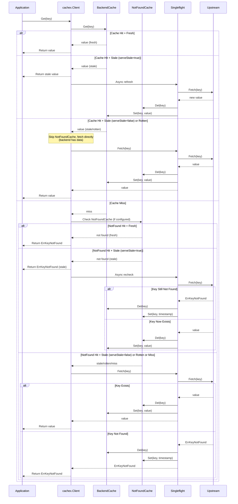

# Cachex

> A high-performance, feature-rich Go caching library with generics, layered caching, and serve-stale mechanism.

[](https://pkg.go.dev/github.com/theplant/cachex)
[](https://goreportcard.com/report/github.com/theplant/cachex)
[](LICENSE)

[English](README.md) | [中文文档](README_ZH.md)

## Features

- **🛡️ Cache Stampede Protection** - Singleflight + DoubleCheck mechanisms eliminate redundant fetches, preventing traffic surge when hot keys expire
- **🚫 Cache Penetration Defense** - Not-Found caching mechanism prevents malicious queries from overwhelming the database
- **🔄 Serve-Stale** - Serves stale data while asynchronously refreshing, ensuring high availability and low latency
- **🎪 Layered Caching** - Flexible multi-level caching (L1 Memory + L2 Redis), Client can also be used as upstream
- **📦 Batch Reads** - `GetMany` reads many keys at once and fetches all misses together (one upstream call if the upstream implements `BatchUpstream`), keeping singleflight, DoubleCheck, Not-Found caching and serve-stale
- **🚀 High Performance** - Sub-microsecond latency, 79x~1729x throughput amplification, zero error rate
- **🎯 Type-Safe** - Go generics provide compile-time type safety, avoiding runtime type errors
- **⏱️ Flexible TTL** - Independent fresh and stale TTL configuration for precise data lifecycle control
- **🔧 Extensible** - Clean interface design makes it easy to implement custom cache backends

## Quick Start

### Installation

```bash
go get github.com/theplant/cachex
```

### Basic Example

```go
package main

import (
    "context"
    "fmt"
    "time"

    "github.com/theplant/cachex"
)

type Product struct {
    ID    string
    Name  string
    Price int64
}

func main() {
    // Create data cache
    cacheConfig := cachex.DefaultRistrettoCacheConfig[*cachex.Entry[*Product]]()
    cacheConfig.TTL = 30 * time.Second // 5s fresh + 25s stale
    cache, _ := cachex.NewRistrettoCache(cacheConfig)
    defer cache.Close()

    // Create not-found cache
    notFoundConfig := cachex.DefaultRistrettoCacheConfig[time.Time]()
    notFoundConfig.TTL = 6 * time.Second // 1s fresh + 5s stale
    notFoundCache, _ := cachex.NewRistrettoCache(notFoundConfig)
    defer notFoundCache.Close()

    // Define upstream data source
    upstream := cachex.UpstreamFunc[*cachex.Entry[*Product]](
        func(ctx context.Context, key string) (*cachex.Entry[*Product], error) {
            // Fetch from database or API
            // Return &cachex.ErrKeyNotFound{} for non-existent keys
            product := &Product{ID: key, Name: "Product " + key, Price: 9900}
            return &cachex.Entry[*Product]{
                Data:     product,
                CachedAt: time.Now(),
            }, nil
        },
    )

    // Create client with all features enabled
    client := cachex.NewClient(
        cache,
        upstream,
        cachex.EntryWithTTL[*Product](5*time.Second, 25*time.Second), // 5s fresh, 25s stale
        cachex.NotFoundWithTTL[*cachex.Entry[*Product]](notFoundCache, 1*time.Second, 5*time.Second),
        cachex.WithServeStale[*cachex.Entry[*Product]](true),
    )

    // Use the cache
    ctx := context.Background()
    entry, _ := client.Get(ctx, "product-123")
    fmt.Printf("Product: %+v\n", entry.Data)
}
```

## Architecture


```mermaid
sequenceDiagram
    participant App as Application
    participant Client as cachex.Client
    participant Cache as BackendCache
    participant NFCache as NotFoundCache
    participant SF as Singleflight
    participant Upstream

    App->>Client: Get(key)
    Client->>Cache: Get(key)

    alt Cache Hit + Fresh
        Cache-->>Client: value (fresh)
        Client-->>App: Return value
    else Cache Hit + Stale (serveStale=true)
        Cache-->>Client: value (stale)
        Client-->>App: Return stale value
        Client->>SF: Async refresh
        SF->>Upstream: Fetch(key)
        Upstream-->>SF: new value
        SF->>NFCache: Del(key)
        SF->>Cache: Set(key, value)
    else Cache Hit + Stale (serveStale=false) or Rotten
        Cache-->>Client: value (stale/rotten)
        Note over Client: Skip NotFoundCache, fetch directly<br/>(backend has data)
        Client->>SF: Fetch(key)
        SF->>Upstream: Fetch(key)
        Upstream-->>SF: value
        SF->>NFCache: Del(key)
        SF->>Cache: Set(key, value)
        SF-->>Client: value
        Client-->>App: Return value
    else Cache Miss
        Cache-->>Client: miss
        Client->>NFCache: Check NotFoundCache (if configured)
        alt NotFound Hit + Fresh
            NFCache-->>Client: not found (fresh)
            Client-->>App: Return ErrKeyNotFound
        else NotFound Hit + Stale (serveStale=true)
            NFCache-->>Client: not found (stale)
            Client-->>App: Return ErrKeyNotFound (stale)
            Client->>SF: Async recheck
            SF->>Upstream: Fetch(key)
            alt Key Still Not Found
                Upstream-->>SF: ErrKeyNotFound
                SF->>Cache: Del(key)
                SF->>NFCache: Set(key, timestamp)
            else Key Now Exists
                Upstream-->>SF: value
                SF->>NFCache: Del(key)
                SF->>Cache: Set(key, value)
            end
        else NotFound Hit + Stale (serveStale=false) or Rotten or Miss
            NFCache-->>Client: stale/rotten/miss
            Client->>SF: Fetch(key)
            SF->>Upstream: Fetch(key)
            alt Key Exists
                Upstream-->>SF: value
                SF->>NFCache: Del(key)
                SF->>Cache: Set(key, value)
                SF-->>Client: value
                Client-->>App: Return value
            else Key Not Found
                Upstream-->>SF: ErrKeyNotFound
                SF->>Cache: Del(key)
                SF->>NFCache: Set(key, timestamp)
                SF-->>Client: ErrKeyNotFound
                Client-->>App: Return ErrKeyNotFound
            end
        end
    end
```

### Core Components

- **Client** - Orchestrates caching logic, TTL, and refresh strategies (Client itself implements Cache interface and can also be used as upstream)
- **BackendCache** - Storage layer (Ristretto, Redis, GORM, or custom), also serves as Upstream interface
- **NotFoundCache** - Dedicated cache for non-existent keys to prevent cache penetration
- **Upstream** - Data source (database, API, another Client, or custom)
- **Singleflight** - Deduplicates concurrent requests for the same key (primary defense against cache stampede)
- **DoubleCheck** - Re-checks backend and notFoundCache before upstream fetch to catch concurrent writes (eliminates race window)
- **Entry** - Wrapper with timestamp for time-based staleness checks

## Cache Backends

### Ristretto (In-Memory)

High-performance, TinyLFU-based in-memory cache.

```go
config := cachex.DefaultRistrettoCacheConfig[*Product]()
config.TTL = 30 * time.Second
cache, err := cachex.NewRistrettoCache(config)
defer cache.Close()
```

### Redis

Distributed cache with customizable serialization.

```go
cache := cachex.NewRedisCache[*Product](&cachex.RedisCacheConfig{
    Client:    redisClient,
    KeyPrefix: "product:",     // key prefix
    TTL:       30*time.Second,
})
```

### GORM (Database)

Use your database as a cache layer (useful for persistence).

```go
cache := cachex.NewGORMCache[*Product](&cachex.GORMCacheConfig{
    DB:        db,
    TableName: "cache_products",
})
// Create the table if needed
if err := cache.Migrate(ctx); err != nil {
    // handle error
}
```

Cache keys are case-sensitive, so the `key` column should compare byte for byte. PostgreSQL and SQLite do by default; on MySQL, `Migrate` creates a `varchar(255)` with the table's collation, usually case- and accent-insensitive (`*_ci`), so give the table or the column a `*_bin` collation (e.g. `utf8mb4_bin`). Without it nothing wrong is ever served: `GORMCache` only returns the row stored under exactly the requested key, so keys differing only in case just take the row over from each other (extra misses).

### Custom Cache

Implement the `Cache[T]` interface:

```go
type Cache[T any] interface {
    Get(ctx context.Context, key string) (T, error)
    Set(ctx context.Context, key string, value T) error
    Del(ctx context.Context, key string) error
}
```

**Important**: When a key does not exist, the `Get` method must return a `*cachex.ErrKeyNotFound` error (for example `&cachex.ErrKeyNotFound{}`, optionally wrapped), so the Client can correctly distinguish between cache misses and other error conditions. Use `cachex.IsErrKeyNotFound(err)` to check for it.

`Set` takes no TTL: expiry is decided by the Client (`WithStale` / `EntryWithTTL`), and backends that support a hard TTL take it in their config (`RistrettoCacheConfig.TTL`, `RedisCacheConfig.TTL`).

Optionally implement `BatchCache[T]` as well, so `Client.GetMany` reads and writes your backend in one call per batch instead of key by key (see [Batch Reads](#batch-reads)):

```go
type BatchCache[T any] interface {
    Cache[T]
    // Missing keys are absent from the map; do not report them as ErrKeyNotFound.
    // Errors follow BatchUpstream below: any error other than an unwrapped
    // *cachex.BatchError fails every key (it is not read as all misses).
    GetMany(ctx context.Context, keys []string) (map[string]T, error)
    SetMany(ctx context.Context, values map[string]T) error
    DelMany(ctx context.Context, keys []string) error
}
```

## Advanced Features

### Layered Caching

Combine multiple cache layers for optimal performance. Client implements both `Cache[T]` and `Upstream[T]` interfaces, allowing it to be used directly as upstream for the next layer:

```go
// L2: Redis cache with database upstream
l2Cache := cachex.NewRedisCache[*cachex.Entry[*Product]](&cachex.RedisCacheConfig{
    Client:    redisClient,
    KeyPrefix: "product:",
    TTL:       10 * time.Minute,
})

dbUpstream := cachex.UpstreamFunc[*cachex.Entry[*Product]](
    func(ctx context.Context, key string) (*cachex.Entry[*Product], error) {
        product, err := fetchFromDB(ctx, key)
        if err != nil {
            return nil, err
        }
        return &cachex.Entry[*Product]{
            Data:     product,
            CachedAt: time.Now(),
        }, nil
    },
)

l2Client := cachex.NewClient(
    l2Cache,
    dbUpstream,
    cachex.EntryWithTTL[*Product](1*time.Minute, 9*time.Minute),
)

// L1: In-memory cache with L2 client as upstream
// Client can be used directly as upstream for the next layer
l1Cache, _ := cachex.NewRistrettoCache(
    cachex.DefaultRistrettoCacheConfig[*cachex.Entry[*Product]](),
)
defer l1Cache.Close()

l1Client := cachex.NewClient(
    l1Cache,
    l2Client, // Client implements Upstream[T], use directly
    cachex.EntryWithTTL[*Product](5*time.Second, 25*time.Second),
    cachex.WithServeStale[*cachex.Entry[*Product]](true),
)

// Read: L1 miss → L2 → Database (if L2 also misses)
product, _ := l1Client.Get(ctx, "product-123")
```

#### Write Propagation

When you use a `Client` as the upstream for another `Client`, write operations (`Set`/`Del`) automatically propagate through all cache layers, stopping naturally when upstream doesn't implement `Cache[T]`:

```
L1 Cache → L2 Cache → L3 Cache → Database
   ✅        ✅         ✅          ❌ (auto-stop)
```

The propagation works through **type-based detection**: if upstream implements `Cache[T]` interface, writes propagate; if upstream doesn't implement `Cache[T]` (e.g. `UpstreamFunc` for data sources), propagation stops.

**Pattern Support:**

This design naturally supports both caching patterns:

- **Write-Through Pattern (Multi-Level Caches):**

  ```go
  // All cache layers stay in sync
  l1Client.Set(ctx, key, value)  // writes ... → L2 → L1, bottom layer first (stops at data source)
  ```

- **Cache-Aside Pattern (Cache + Database):**
  ```go
  // Update database first, then cache
  db.Update(user)
  l1Client.Set(ctx, userID, user)  // Only updates cache layers, not DB
  ```

The key insight: **cache writes propagate through `Cache[T]` chains but stop when upstream doesn't implement `Cache[T]`**, making it safe and correct for both patterns.

**Write order and consistency:**

- `Set`/`Del` write the **upstream first**, then this layer, so a new value never shows up in an upper layer before the layer below has it: a `Set` becomes visible in this layer only after the write below has succeeded. The flip side is a short window while the write runs: until this layer's own write lands, a concurrent reader of this layer still sees its **old** value (after a `Del`, the deleted one), even though the layer below has already changed. Once `Set`/`Del` returns, the window is closed.
- If the upstream write fails, its state is unknown (it may have been applied with only the reply lost), so this layer **drops** its entry for the key (and any cached Not-Found) and returns the error; the next read goes down. A failed `Del` likewise drops this layer's entry but caches no Not-Found.
- Concurrent `Set`/`Del` of one key through the same `Client` are applied one at a time, in the same order on every layer.
- A read that fetched a value **before** a concurrent `Set`/`Del` still returns what it fetched, but never writes it back over the newer value: each `Client` hashes keys into 1,024 stripes, each with a write lock and a write generation, and `Get`, `GetMany` and the serve-stale refresh check the key's stripe generation while holding its lock for reading, so a backfill either lands before a `Set`/`Del` (which then overwrites it) or is skipped. A backfill is also skipped while a write to the stripe is in progress, so reads never wait on writes. Keys that share a stripe share this state: their writes run one at a time, and a write to one key can skip a backfill of another. The cost is at most an extra cache miss, or a write waiting on a write to an unrelated key.
- These guarantees hold within one process; separate processes sharing a lower layer (e.g. Redis) can still briefly disagree in their memory layers.

### Not-Found Caching

Prevent repeated lookups for non-existent keys:

```go
notFoundCache, _ := cachex.NewRistrettoCache(
    cachex.DefaultRistrettoCacheConfig[time.Time](),
)
defer notFoundCache.Close()

client := cachex.NewClient(
    dataCache,
    upstream,
    cachex.EntryWithTTL[*Product](5*time.Second, 25*time.Second),
    cachex.NotFoundWithTTL[*cachex.Entry[*Product]](
        notFoundCache,
        1*time.Second,  // fresh TTL
        5*time.Second,  // stale TTL
    ),
)
```

### Batch Reads

`Client.GetMany` reads many keys at once with the same semantics as calling `Get` for each key, but in batches:

```go
products, err := client.GetMany(ctx, []string{"p1", "p2", "p3"})
// products holds only the keys that exist; missing keys are absent
```

To let the upstream answer a batch in one call, implement `BatchUpstream[T]` on it (it should still implement `Upstream[T]` for `Get`):

```go
type BatchUpstream[T any] interface {
    // Keys absent from the map do not exist (like ErrKeyNotFound for Get).
    // A non-nil error fails the whole batch, unless it is a *cachex.BatchError
    // returned as is (not wrapped), which fails only the keys it lists.
    // A whole-batch error fails every key, even if it wraps an ErrKeyNotFound:
    // errors.Is/As still see it, but IsErrKeyNotFound reports false.
    GetMany(ctx context.Context, keys []string) (map[string]T, error)
}

type productSource struct{ db *gorm.DB }

func (s productSource) GetMany(ctx context.Context, ids []string) (map[string]*cachex.Entry[*Product], error) {
    var rows []*Product // for very large batches, query in chunks to stay under the bound-parameter limit
    if err := s.db.WithContext(ctx).Where("id IN ?", ids).Find(&rows).Error; err != nil {
        return nil, err
    }
    now := time.Now()
    out := make(map[string]*cachex.Entry[*Product], len(rows))
    for _, p := range rows {
        out[p.ID] = &cachex.Entry[*Product]{Data: p, CachedAt: now}
    }
    return out, nil // ids not found are simply absent
}

// Get is still required (Upstream[T]); it can reuse GetMany.
func (s productSource) Get(ctx context.Context, id string) (*cachex.Entry[*Product], error) {
    entries, err := s.GetMany(ctx, []string{id})
    if err != nil {
        return nil, err
    }
    if e, ok := entries[id]; ok {
        return e, nil
    }
    return nil, &cachex.ErrKeyNotFound{}
}

client := cachex.NewClient(cache, productSource{db: db} /* , options as in Quick Start */)
```

How `GetMany` works:

1. **Backend**: one batch read (`BatchCache[T]`, otherwise key by key). Each value is classified by staleness: fresh values are returned, stale values are returned and refreshed in the background together (with `WithServeStale`), rotten values and misses go on.
2. **Not-Found cache**: misses are checked against it, exactly like `Get`.
3. **Singleflight**: every key that needs the upstream is claimed in the **same** singleflight `Get` uses. Keys already being fetched by a `Get` or another `GetMany` are waited for, not fetched again; so a `Get` and a `GetMany` (or two overlapping `GetMany`s) fetch a shared key only once. `WithFetchConcurrency` applies per key as usual.
4. **DoubleCheck**: the claimed keys are re-checked against the backend and Not-Found cache, by the same rules as `Get`.
5. **Upstream**: if the upstream implements `BatchUpstream[T]`, the remaining keys are fetched with **one** `GetMany` call (one `WithFetchTimeout` for the whole call). Otherwise each key is fetched exactly as `Get` would (its own double-check, fetch timeout and write-back, and handed to its waiters as soon as it arrives), at most `WithGetManyConcurrency` (default 16) at a time; a key is claimed only when its turn comes, so a concurrent `Get` of a key still queued here does not wait for the queue, and a canceled `GetMany` starts no more keys.
6. **Write back**: found values go to the backend, missing keys to the Not-Found cache. With a `BatchUpstream` this is one `SetMany`/`DelMany` per batch (when the backend supports it); without one, each key is written back on its own, like `Get`. Either way this only touches this layer, never the upstream.

`Client` implements `BatchUpstream[T]` itself, so in a layered setup a batch travels down as one call per layer: `l1Client.GetMany` → L1 batch read → `l2Client.GetMany` → L2 batch read → one database query.

**Errors**: the returned map always holds every key that succeeded. If some keys failed (backend, upstream or context errors), the error is a `*cachex.BatchError` whose `Errors` map lists them by key; `errors.Is`/`errors.As` see through it to the per-key errors. A per-key error is always a real failure, never a not-found: keys that do not exist are just absent from the map.

```go
products, err := client.GetMany(ctx, ids)
var batchErr *cachex.BatchError
if errors.As(err, &batchErr) {
    for id, err := range batchErr.Errors {
        log.Printf("product %s failed: %v", id, err)
    }
}
// products is usable either way
```

These built-in backends implement `BatchCache[T]`: `RistrettoCache`, `SyncMap`, `RedisCache` (one pipeline of `GET`/`SET`/`DEL`, which also works on Redis Cluster) and `GORMCache` (`WHERE key IN (...)` and multi-row upserts, 1000 keys per statement to stay under the bound parameter limits). `BigCache` and the `Transform` wrappers do not, so `GetMany` reads and writes them key by key (wrapping a `RedisCache` in `Transform` means one round trip per key).

Fetching 100 missing keys through an upstream that costs 1ms per call (`BenchmarkGetManyVsGet`):

| | upstream calls | time |
|---|---|---|
| `GetMany` | 1 | ~1.2ms |
| loop of `Get` | 100 | ~115ms |

### Custom Staleness Logic

Define custom staleness checks:

```go
client := cachex.NewClient(
    cache,
    upstream,
    cachex.WithStale[*Product](func(p *Product) cachex.State {
        age := time.Since(p.UpdatedAt)
        if age < 5*time.Second {
            return cachex.StateFresh
        }
        if age < 5*time.Second + 25*time.Second {
            return cachex.StateStale
        }
        return cachex.StateRotten
    }),
    cachex.WithServeStale[*Product](true),
)
```

### Type Transformation

Transform between different cache types:

```go
// Cache stores JSON strings
stringCache := cachex.NewRedisCache[string](&cachex.RedisCacheConfig{
    Client:    client,
    KeyPrefix: "user:",
    TTL:       time.Hour,
})

// Transform to User objects
userCache := cachex.StringJSONTransform[*User](stringCache)

// Use as Cache[*User]
user, err := userCache.Get(ctx, "user:123")
```

## Performance

> See [BENCHMARK.md](BENCHMARK.md) for detailed results.

### Key Metrics (10K products, Pareto traffic distribution, **cold start**)

| Scenario       | Concurrency | Application QPS | Cache Hit Rate |   P50 |   P99 | DB Conn Pool | DB QPS | DB Utilization | Amplification | Errors |
| :------------- | ----------: | --------------: | -------------: | ----: | ----: | -----------: | -----: | -------------: | ------------: | -----: |
| High Perf DB   |         600 |         504,989 |         99.81% | 291ns | 3.3µs |          100 |  982.5 |          88.4% |        514.0x |     0% |
| Cloud DB       |         100 |          55,222 |         99.61% | 833ns |  12µs |           20 |  213.8 |          90.9% |        235.0x |     0% |
| Shared DB      |         100 |           7,306 |         98.59% | 791ns | 831ms |           13 |  103.0 |          99.0% |         70.2x |     0% |
| Constrained DB |         100 |             695 |         94.01% | 1.3µs | 2.04s |            8 |   41.6 |          98.8% |         16.7x |     0% |

> 💡 **Cold Start Performance**: Cachex achieves **94%+ cache hit rate** even during cold start without pre-warming. With cache pre-warming, throughput can increase dramatically (99%+ hit rate → minimal DB load).
>
> 🔥 **Test Environment Simulation**: All benchmark scenarios use realistic database connection pool simulation (semaphore-based), accurately simulating real-world database behavior.
>
> 📊 **Throughput Amplification** = Application QPS / Theoretical DB Capacity, where Theoretical DB Capacity = Conn Pool / (Latency / 1000ms).

## FAQ

### Q: When should I use `Entry[T]` vs custom staleness?

**A:** Use `Entry[T]` with `EntryWithTTL` for simple time-based expiration. Use custom staleness checkers when you need domain-specific logic (e.g., checking a `version` field).

### Q: How does cache stampede protection work?

**A:** Cachex uses a two-layer defense based on the philosophy of **concurrent exploration + result convergence**:

1. **Singleflight with Concurrency Control** (Primary):

   - **Exploration phase**: When cache misses, `WithFetchConcurrency` allows N concurrent fetches to maximize throughput
   - **Default (N=1)**: Full deduplication - only one fetch, others wait (99%+ redundancy elimination)
   - **N > 1**: Moderate redundancy - requests distributed across N slots for higher throughput

2. **DoubleCheck** (Supplementary):
   - Handles the narrow race window where Request B checks the cache (miss) before Request A completes its write
   - Works **across all singleflight slots**, enabling fast convergence after first successful fetch
   - Auto-enabled by default when notFoundCache is configured (smart detection)
   - Configure with `WithDoubleCheck(DoubleCheckEnabled/Disabled/Auto)` based on your scenario

### Q: What's the difference between fresh and stale TTL?

**A:** Fresh TTL defines how long data is considered fresh. Stale TTL defines an **additional** period during which data can be served as stale (with async refresh). Total lifetime = `freshTTL + staleTTL`.

### Q: Should I cache all database queries?

**A:** No. Cache frequently accessed, relatively static data. Avoid caching:

- Data that changes frequently (< 1s freshness requirement)
- User-specific data with high cardinality
- Large objects that don't fit in memory efficiently

## License

This project is licensed under the MIT License - see the [LICENSE](LICENSE) file for details.
