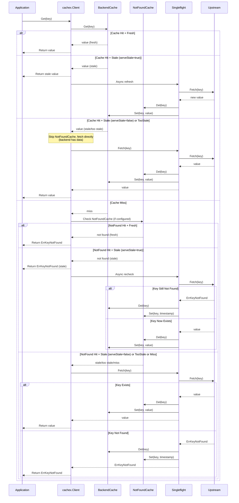

# Cachex

> 一个高性能、功能丰富的 Go 缓存库，支持泛型、分层缓存和 serve-stale 机制。

[](https://pkg.go.dev/github.com/theplant/cachex)
[](https://goreportcard.com/report/github.com/theplant/cachex)
[](LICENSE)

[English](README.md) | [中文文档](README_ZH.md)

## 特性

- **🛡️ 防御缓存击穿** - Singleflight + DoubleCheck 双重机制消除冗余拉取，防止热点 key 失效时的流量冲击
- **🚫 防御缓存穿透** - Not-Found 缓存机制，缓存不存在的 key，避免恶意查询打垮数据库
- **🔄 Serve-Stale** - 提供陈旧数据的同时异步刷新，确保高可用性和低延迟
- **🎪 分层缓存** - 灵活组合多级缓存（L1 内存 + L2 Redis），Client 可作为下层 Upstream
- **🚀 高性能** - 亚微秒级延迟，79x~1729x 吞吐量放大，零错误率
- **🎯 类型安全** - Go 泛型提供编译时类型安全，避免运行时类型错误
- **⏱️ 灵活 TTL** - 独立的新鲜和陈旧 TTL 配置，精确控制数据生命周期
- **🔧 可扩展** - 简洁的接口设计，易于实现自定义缓存后端

## 快速开始

### 安装

```bash
go get github.com/theplant/cachex
```

### 基础示例

```go
package main

import (
    "context"
    "fmt"
    "time"

    "github.com/theplant/cachex"
)

type Product struct {
    ID    string
    Name  string
    Price int64
}

func main() {
    // Create data cache
    cacheConfig := cachex.DefaultRistrettoCacheConfig[*cachex.Entry[*Product]]()
    cacheConfig.TTL = 30 * time.Second // 5s fresh + 25s stale
    cache, _ := cachex.NewRistrettoCache(cacheConfig)
    defer cache.Close()

    // Create not-found cache
    notFoundConfig := cachex.DefaultRistrettoCacheConfig[time.Time]()
    notFoundConfig.TTL = 6 * time.Second // 1s fresh + 5s stale
    notFoundCache, _ := cachex.NewRistrettoCache(notFoundConfig)
    defer notFoundCache.Close()

    // Define upstream data source
    upstream := cachex.UpstreamFunc[*cachex.Entry[*Product]](
        func(ctx context.Context, key string) (*cachex.Entry[*Product], error) {
            // Fetch from database or API
            // Return cachex.ErrKeyNotFound for non-existent keys
            product := &Product{ID: key, Name: "Product " + key, Price: 9900}
            return &cachex.Entry[*Product]{
                Data:     product,
                CachedAt: time.Now(),
            }, nil
        },
    )

    // Create client with all features enabled
    client := cachex.NewClient(
        cache,
        upstream,
        cachex.EntryWithTTL[*Product](5*time.Second, 25*time.Second), // 5s fresh, 25s stale
        cachex.NotFoundWithTTL[*cachex.Entry[*Product]](notFoundCache, 1*time.Second, 5*time.Second),
        cachex.WithServeStale[*cachex.Entry[*Product]](true),
        cachex.WithFetchConcurrency[*cachex.Entry[*Product]](1), // Full singleflight
    )
    defer client.Close() // 清理资源

    // Use the cache
    ctx := context.Background()
    entry, _ := client.Get(ctx, "product-123")
    fmt.Printf("Product: %+v\n", entry.Data)
}
```

## 架构设计

Cachex 采用清晰的分层架构。



### 核心组件

- **Client** - 编排缓存逻辑、TTL 和刷新策略（Client 本身也实现了 Cache 接口，也可作为上游使用）
- **BackendCache** - 存储层（Ristretto、Redis、GORM 或自定义），同时也是 Upstream 接口
- **NotFoundCache** - 专门缓存不存在的 key，防止缓存穿透
- **Upstream** - 数据源（数据库、API、另一个 Client 或自定义）
- **Singleflight** - 对相同 key 的并发请求去重（防御缓存击穿的主要机制）
- **DoubleCheck** - 在 singleflight 内对最近写入的 key 重新检查本地缓存（消除剩余边界情况）
- **Entry** - 带时间戳的包装器，用于基于时间的陈旧检查

## 缓存后端

### Ristretto（内存）

高性能、基于 TinyLFU 的内存缓存。

```go
config := cachex.DefaultRistrettoCacheConfig[*Product]()
config.TTL = 30 * time.Second
cache, err := cachex.NewRistrettoCache(config)
defer cache.Close()
```

### Redis

支持自定义序列化的分布式缓存。

```go
cache := cachex.NewRedisCache[*Product](
    redisClient,
    "product:",     // key 前缀
    30*time.Second, // TTL
)
```

### GORM（数据库）

将数据库用作缓存层（适用于持久化需求）。

```go
cache := cachex.NewGORMCache(
    db,
    "cache_products",
    30*time.Second,
)
```

### 自定义缓存

实现 `Cache[T]` 接口：

```go
type Cache[T any] interface {
    Set(ctx context.Context, key string, value T, ttl time.Duration) error
    Get(ctx context.Context, key string) (T, error)
    Del(ctx context.Context, key string) error
}
```

**重要**：当 key 不存在时，`Get` 方法必须返回 `cachex.ErrKeyNotFound` 错误，以便 Client 能够正确区分缓存未命中和其他错误情况。

## 高级特性

### 分层缓存

组合多个缓存层以获得最佳性能。Client 实现了 `Cache[T]` 和 `Upstream[T]` 接口，可以直接作为下一层的 upstream 使用：

```go
// L2: Redis cache with database upstream
l2Cache := cachex.NewRedisCache[*cachex.Entry[*Product]](
    redisClient, "product:", 10*time.Minute,
)

dbUpstream := cachex.UpstreamFunc[*cachex.Entry[*Product]](
    func(ctx context.Context, key string) (*cachex.Entry[*Product], error) {
        product, err := fetchFromDB(ctx, key)
        if err != nil {
            return nil, err
        }
        return &cachex.Entry[*Product]{
            Data:     product,
            CachedAt: time.Now(),
        }, nil
    },
)

l2Client := cachex.NewClient(
    l2Cache,
    dbUpstream,
    cachex.EntryWithTTL[*Product](1*time.Minute, 9*time.Minute),
)
defer l2Client.Close()

// L1: In-memory cache with L2 client as upstream
// Client can be used directly as upstream for the next layer
l1Cache, _ := cachex.NewRistrettoCache(
    cachex.DefaultRistrettoCacheConfig[*cachex.Entry[*Product]](),
)
defer l1Cache.Close()

l1Client := cachex.NewClient(
    l1Cache,
    l2Client, // Client implements Upstream[T], use directly
    cachex.EntryWithTTL[*Product](5*time.Second, 25*time.Second),
    cachex.WithServeStale[*cachex.Entry[*Product]](true),
)
defer l1Client.Close()
```

### Not-Found 缓存

防止对不存在 key 的重复查询：

```go
notFoundCache, _ := cachex.NewRistrettoCache(
    cachex.DefaultRistrettoCacheConfig[time.Time](),
)
defer notFoundCache.Close()

client := cachex.NewClient(
    dataCache,
    upstream,
    cachex.EntryWithTTL[*Product](5*time.Second, 25*time.Second),
    cachex.NotFoundWithTTL[*cachex.Entry[*Product]](
        notFoundCache,
        1*time.Second,  // 新鲜 TTL
        5*time.Second,  // 过期 TTL
    ),
)
defer client.Close()
```

### 自定义陈旧逻辑

定义自定义的陈旧检查：

```go
client := cachex.NewClient(
    cache,
    upstream,
    cachex.WithStale[*Product](func(p *Product) cachex.State {
        age := time.Since(p.UpdatedAt)
        if age < 5*time.Second {
            return cachex.StateFresh
        }
        if age < 5*time.Second + 25*time.Second {
            return cachex.StateStale
        }
        return cachex.StateTooStale
    }),
    cachex.WithServeStale[*Product](true),
)
defer client.Close()
```

### 类型转换

在不同缓存类型之间转换：

```go
// 缓存存储 JSON 字符串
stringCache := cachex.NewRedisCache[string](client, "user:", time.Hour)

// 转换为 User 对象
userCache := cachex.JSONTransform[string, *User](stringCache)

// 作为 Cache[*User] 使用
user, err := userCache.Get(ctx, "user:123")
```

## 性能表现

> 详细结果见 [BENCHMARK_ZH.md](BENCHMARK_ZH.md)。

### 关键指标（10K 商品，帕累托流量分布）

| 场景        | 应用层 QPS | 缓存命中率 |   P50 |     P99 | 吞吐量放大 |
| :---------- | ---------: | ---------: | ----: | ------: | ---------: |
| 高性能 DB   |     86,813 |     99.87% |   1µs | 4.042µs |        79x |
| 云 1000QPS  |     86,287 |     99.88% | 917ns | 4.125µs |        82x |
| 共享 100QPS |     86,827 |     99.88% | 959ns | 4.958µs |       827x |
| 受限 50QPS  |     86,609 |     99.88% | 333ns | 2.375µs |     1,729x |

> 💡 通过自适应 TTL 策略，Cachex 提供 **79 倍到 1,729 倍的吞吐量放大**，且零错误。

## 常见问题

### Q: 何时应该使用 `Entry[T]` 而不是自定义陈旧检查？

**A:** 对于简单的基于时间的过期，使用 `Entry[T]` 配合 `EntryWithTTL`。当需要领域特定逻辑（如检查 `version` 字段）时，使用自定义陈旧检查器。

### Q: 缓存击穿防护如何工作？

**A:** Cachex 使用双层防御机制：

1. **Singleflight**（主要）：对相同 key 的并发请求去重。只有一个 goroutine 从上游获取数据；其他 goroutine 等待并接收相同结果。这消除了 99%+ 的冗余拉取。通过 `WithFetchConcurrency` 配置。

2. **DoubleCheck**（辅助）：处理窄竞态窗口，即请求 B 在请求 A 完成写入之前检查缓存（miss）。当 B 进入 singleflight 并检测到 A 刚刚写入了 key，B 会重新检查本地缓存而不是再次拉取。此优化默认启用，窗口为 10ms。如不需要可通过 `WithDoubleCheck(nil, 0)` 禁用。

### Q: 新鲜 TTL 和过期 TTL 有什么区别？

**A:** 新鲜 TTL 定义数据被视为新鲜的时长。过期 TTL 定义在新鲜期后的**额外**时长，在此期间数据可作为陈旧数据提供（并异步刷新）。总生命周期 = `新鲜TTL + 过期TTL`。

### Q: 是否应该缓存所有数据库查询？

**A:** 不应该。缓存频繁访问、相对静态的数据。避免缓存：

- 频繁变化的数据（< 1s 新鲜度要求）
- 高基数的用户特定数据
- 不适合在内存中高效存储的大对象

## 许可证

本项目采用 MIT 许可证 - 详见 [LICENSE](LICENSE) 文件。
