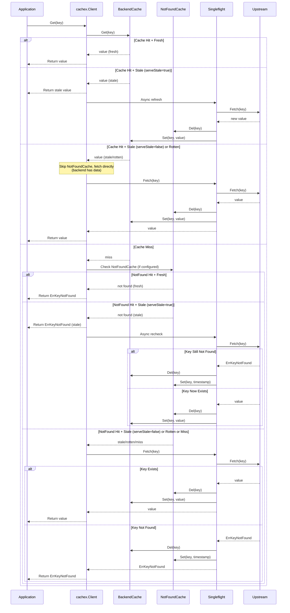

# Cachex

> 一个高性能、功能丰富的 Go 缓存库，支持泛型、分层缓存和 serve-stale 机制。

[](https://pkg.go.dev/github.com/theplant/cachex)
[](https://goreportcard.com/report/github.com/theplant/cachex)
[](LICENSE)

[English](README.md) | [中文文档](README_ZH.md)

## 特性

- **🛡️ 防御缓存击穿** - Singleflight + DoubleCheck 双重机制消除冗余拉取，防止热点 key 失效时的流量冲击
- **🚫 防御缓存穿透** - Not-Found 缓存机制，缓存不存在的 key，避免恶意查询打垮数据库
- **🔄 Serve-Stale** - 提供陈旧数据的同时异步刷新，确保高可用性和低延迟
- **🎪 分层缓存** - 灵活组合多级缓存（L1 内存 + L2 Redis），Client 可作为下层 Upstream
- **📦 批量读取** - `GetMany` 一次读多个 key，未命中的一起拉取（上游实现了 `BatchUpstream` 就合成一次调用），singleflight、DoubleCheck、Not-Found 缓存、serve-stale 照样生效
- **🚀 高性能** - 亚微秒级延迟，79x~1729x 吞吐量放大，零错误率
- **🎯 类型安全** - Go 泛型提供编译时类型安全，避免运行时类型错误
- **⏱️ 灵活 TTL** - 独立的新鲜和陈旧 TTL 配置，精确控制数据生命周期
- **🔧 可扩展** - 简洁的接口设计，易于实现自定义缓存后端

## 快速开始

### 安装

```bash
go get github.com/theplant/cachex
```

### 基础示例

```go
package main

import (
    "context"
    "fmt"
    "time"

    "github.com/theplant/cachex"
)

type Product struct {
    ID    string
    Name  string
    Price int64
}

func main() {
    // Create data cache
    cacheConfig := cachex.DefaultRistrettoCacheConfig[*cachex.Entry[*Product]]()
    cacheConfig.TTL = 30 * time.Second // 5s fresh + 25s stale
    cache, _ := cachex.NewRistrettoCache(cacheConfig)
    defer cache.Close()

    // Create not-found cache
    notFoundConfig := cachex.DefaultRistrettoCacheConfig[time.Time]()
    notFoundConfig.TTL = 6 * time.Second // 1s fresh + 5s stale
    notFoundCache, _ := cachex.NewRistrettoCache(notFoundConfig)
    defer notFoundCache.Close()

    // Define upstream data source
    upstream := cachex.UpstreamFunc[*cachex.Entry[*Product]](
        func(ctx context.Context, key string) (*cachex.Entry[*Product], error) {
            // Fetch from database or API
            // Return &cachex.ErrKeyNotFound{} for non-existent keys
            product := &Product{ID: key, Name: "Product " + key, Price: 9900}
            return &cachex.Entry[*Product]{
                Data:     product,
                CachedAt: time.Now(),
            }, nil
        },
    )

    // Create client with all features enabled
    client := cachex.NewClient(
        cache,
        upstream,
        cachex.EntryWithTTL[*Product](5*time.Second, 25*time.Second), // 5s fresh, 25s stale
        cachex.NotFoundWithTTL[*cachex.Entry[*Product]](notFoundCache, 1*time.Second, 5*time.Second),
        cachex.WithServeStale[*cachex.Entry[*Product]](true),
    )

    // Use the cache
    ctx := context.Background()
    entry, _ := client.Get(ctx, "product-123")
    fmt.Printf("Product: %+v\n", entry.Data)
}
```

## 架构设计


```mermaid
sequenceDiagram
    participant App as Application
    participant Client as cachex.Client
    participant Cache as BackendCache
    participant NFCache as NotFoundCache
    participant SF as Singleflight
    participant Upstream

    App->>Client: Get(key)
    Client->>Cache: Get(key)

    alt Cache Hit + Fresh
        Cache-->>Client: value (fresh)
        Client-->>App: Return value
    else Cache Hit + Stale (serveStale=true)
        Cache-->>Client: value (stale)
        Client-->>App: Return stale value
        Client->>SF: Async refresh
        SF->>Upstream: Fetch(key)
        Upstream-->>SF: new value
        SF->>NFCache: Del(key)
        SF->>Cache: Set(key, value)
    else Cache Hit + Stale (serveStale=false) or Rotten
        Cache-->>Client: value (stale/rotten)
        Note over Client: Skip NotFoundCache, fetch directly<br/>(backend has data)
        Client->>SF: Fetch(key)
        SF->>Upstream: Fetch(key)
        Upstream-->>SF: value
        SF->>NFCache: Del(key)
        SF->>Cache: Set(key, value)
        SF-->>Client: value
        Client-->>App: Return value
    else Cache Miss
        Cache-->>Client: miss
        Client->>NFCache: Check NotFoundCache (if configured)
        alt NotFound Hit + Fresh
            NFCache-->>Client: not found (fresh)
            Client-->>App: Return ErrKeyNotFound
        else NotFound Hit + Stale (serveStale=true)
            NFCache-->>Client: not found (stale)
            Client-->>App: Return ErrKeyNotFound (stale)
            Client->>SF: Async recheck
            SF->>Upstream: Fetch(key)
            alt Key Still Not Found
                Upstream-->>SF: ErrKeyNotFound
                SF->>Cache: Del(key)
                SF->>NFCache: Set(key, timestamp)
            else Key Now Exists
                Upstream-->>SF: value
                SF->>NFCache: Del(key)
                SF->>Cache: Set(key, value)
            end
        else NotFound Hit + Stale (serveStale=false) or Rotten or Miss
            NFCache-->>Client: stale/rotten/miss
            Client->>SF: Fetch(key)
            SF->>Upstream: Fetch(key)
            alt Key Exists
                Upstream-->>SF: value
                SF->>NFCache: Del(key)
                SF->>Cache: Set(key, value)
                SF-->>Client: value
                Client-->>App: Return value
            else Key Not Found
                Upstream-->>SF: ErrKeyNotFound
                SF->>Cache: Del(key)
                SF->>NFCache: Set(key, timestamp)
                SF-->>Client: ErrKeyNotFound
                Client-->>App: Return ErrKeyNotFound
            end
        end
    end
```

### 核心组件

- **Client** - 编排缓存逻辑、TTL 和刷新策略（Client 本身也实现了 Cache 接口，也可作为上游使用）
- **BackendCache** - 存储层（Ristretto、Redis、GORM 或自定义），同时也是 Upstream 接口
- **NotFoundCache** - 专门缓存不存在的 key，防止缓存穿透
- **Upstream** - 数据源（数据库、API、另一个 Client 或自定义）
- **Singleflight** - 对相同 key 的并发请求去重（防御缓存击穿的主要机制）
- **DoubleCheck** - 认领回源之后，再查一次 backend 和 notFoundCache，如果别的请求刚把值写进去，就直接用它，不再回源
- **Entry** - 带时间戳的包装器，用于基于时间的陈旧检查

## 缓存后端

### Ristretto（内存）

高性能、基于 TinyLFU 的内存缓存。

```go
config := cachex.DefaultRistrettoCacheConfig[*Product]()
config.TTL = 30 * time.Second
cache, err := cachex.NewRistrettoCache(config)
defer cache.Close()
```

### Redis

支持自定义序列化的分布式缓存。

```go
cache := cachex.NewRedisCache[*Product](&cachex.RedisCacheConfig{
    Client:    redisClient,
    KeyPrefix: "product:",     // key 前缀
    TTL:       30*time.Second,
})
```

### GORM（数据库）

将数据库用作缓存层（适用于持久化需求）。

```go
cache := cachex.NewGORMCache[*Product](&cachex.GORMCacheConfig{
    DB:        db,
    TableName: "cache_products",
})
// 需要时建表
if err := cache.Migrate(ctx); err != nil {
    // 处理错误
}
```

缓存 key 区分大小写，所以 `key` 列应当精确比较。PostgreSQL 和 SQLite 默认如此；MySQL（需 8.0.17 及以上）上 `Migrate` 建表时会用 `utf8mb4_0900_bin`，大小写和末尾空格都精确比较。建表前 `Migrate` 会检查服务端版本：低于 8.0.17 的 MySQL 或 MariaDB 都没有这个排序规则，会返回写明版本号的错误。在这之前建的表（或手工建的表）保留原来的排序规则，通常不区分大小写和重音（`*_ci`），可以用 `ALTER TABLE cache_products CONVERT TO CHARACTER SET utf8mb4 COLLATE utf8mb4_0900_bin` 转换。即使不转换也不会读到错的值：`GORMCache` 只返回 key 完全相等的那一行，只差大小写的几个 key 只会互相挤占这一行（多几次未命中）。

并发的批量写入（多个实例的 `GetMany` 回填）按同一顺序锁行，彼此不会死锁；数据库仍判为死锁牺牲者的写入（MySQL 的间隙锁可能导致）会重试几次。通过 `WithGORMTx` 传入的事务里不重试，因为死锁已经回滚了整个事务，直接返回错误。

### 自定义缓存

实现 `Cache[T]` 接口：

```go
type Cache[T any] interface {
    Get(ctx context.Context, key string) (T, error)
    Set(ctx context.Context, key string, value T) error
    Del(ctx context.Context, key string) error
}
```

**重要**：当 key 不存在时，`Get` 方法必须返回 `*cachex.ErrKeyNotFound` 类型的错误（比如 `&cachex.ErrKeyNotFound{}`，可以再包一层），以便 Client 能够正确区分缓存未命中和其他错误情况。判断时用 `cachex.IsErrKeyNotFound(err)`。

`Set` 不带 TTL 参数：过期由 Client 判断（`WithStale` / `EntryWithTTL`），支持硬过期的后端在各自的配置里设（`RistrettoCacheConfig.TTL`、`RedisCacheConfig.TTL`）。

还可以选择实现 `BatchCache[T]`，这样 `Client.GetMany` 读写这个后端时一批只调一次，而不是逐个 key 调（见[批量读取](#批量读取)）：

```go
type BatchCache[T any] interface {
    Cache[T]
    // 不存在的 key 不出现在结果里，不要用 ErrKeyNotFound 表示。
    // 错误约定同下文的 BatchUpstream：除了原样返回的 *cachex.BatchError，
    // 其他 error 都算所有 key 失败（不会当成全部未命中）。
    GetMany(ctx context.Context, keys []string) (map[string]T, error)
    // 尽力而为：能写的 key 都写，失败的 key 列在原样返回的 *cachex.BatchError 里；
    // 其他 error 表示不知道哪些 key 写成功了。
    SetMany(ctx context.Context, values map[string]T) error
    DelMany(ctx context.Context, keys []string) error
}
```

## 高级特性

### 分层缓存

组合多个缓存层以获得最佳性能。Client 实现了 `Cache[T]` 和 `Upstream[T]` 接口，可以直接作为下一层的 upstream 使用：

```go
// L2: Redis cache with database upstream
l2Cache := cachex.NewRedisCache[*cachex.Entry[*Product]](&cachex.RedisCacheConfig{
    Client:    redisClient,
    KeyPrefix: "product:",
    TTL:       10 * time.Minute,
})

dbUpstream := cachex.UpstreamFunc[*cachex.Entry[*Product]](
    func(ctx context.Context, key string) (*cachex.Entry[*Product], error) {
        product, err := fetchFromDB(ctx, key)
        if err != nil {
            return nil, err
        }
        return &cachex.Entry[*Product]{
            Data:     product,
            CachedAt: time.Now(),
        }, nil
    },
)

l2Client := cachex.NewClient(
    l2Cache,
    dbUpstream,
    cachex.EntryWithTTL[*Product](1*time.Minute, 9*time.Minute),
)

// L1: In-memory cache with L2 client as upstream
// Client can be used directly as upstream for the next layer
l1Cache, _ := cachex.NewRistrettoCache(
    cachex.DefaultRistrettoCacheConfig[*cachex.Entry[*Product]](),
)
defer l1Cache.Close()

l1Client := cachex.NewClient(
    l1Cache,
    l2Client, // Client implements Upstream[T], use directly
    cachex.EntryWithTTL[*Product](5*time.Second, 25*time.Second),
    cachex.WithServeStale[*cachex.Entry[*Product]](true),
)

// 读取: L1 miss → L2 → 数据库 (如果 L2 也 miss)
product, _ := l1Client.Get(ctx, "product-123")
```

#### 写操作传播

当你使用一个 `Client` 作为另一个 `Client` 的 upstream 时，写操作（`Set`/`Del`）会自动在所有缓存层传播，并在 upstream 未实现 `Cache[T]` 时自然停止：

```
L1 缓存 → L2 缓存 → L3 缓存 → 数据库
   ✅        ✅         ✅        ❌ (自动停止)
```

传播机制基于**类型检测**：如果 upstream 实现了 `Cache[T]` 接口，写操作会传播；如果 upstream 未实现 `Cache[T]`（例如 `UpstreamFunc` 数据源），传播自动停止。

**模式支持：**

该设计自然支持两种缓存模式：

- **Write-Through 模式（多级缓存）：**

  ```go
  // 所有缓存层保持同步
  l1Client.Set(ctx, key, value)  // 按 ... → L2 → L1 的顺序写，先写下层（在数据源处停止）
  ```

- **Cache-Aside 模式（缓存 + 数据库）：**
  ```go
  // 先更新数据库，再更新缓存
  db.Update(user)
  l1Client.Set(ctx, userID, user)  // 只更新缓存层，不写数据库
  ```

核心机制：**缓存写操作会在 `Cache[T]` 链上传播，但在 upstream 未实现 `Cache[T]` 时自动停止**，这使得两种模式都安全正确。

**写入顺序与一致性：**

- `Set`/`Del` **先写 upstream**，再写本层，所以新值不会先于下层出现在上层：`Set` 的新值要等下层写成功后才在本层可见。代价是写入过程中有一个短暂的窗口：本层自己的写入落下之前，并发读本层仍会读到它的**旧值**（`Del` 时是已删掉的值），尽管下层已经变了。`Set`/`Del` 返回后窗口就关闭了：之后开始的读不会拿到写入之前回源读到的值（它不会加入更早的那次回源，而是重新回源）。
- upstream 写失败时，它的状态不明（可能已经写进去了，只是回复丢了），所以本层会**删掉**这个 key 的条目（连同缓存的 Not-Found），并返回错误；下次读会回源到下层。`Del` 失败时同样删掉本层条目，但不记 Not-Found。
- upstream 写成功、本层自己的写入失败时，`Set`/`Del` 仍返回错误，但下层的改动**保留**（不回滚）：返回错误不代表什么都没写进去。本层会删掉这个 key 的条目和缓存的 Not-Found，下次读会回源到下层，读到改动后的结果。
- 通过同一个 `Client` 并发 `Set`/`Del` 同一个 key 时，逐个执行，各层的写入顺序一致。需要等待的 `Set`/`Del`（等同一分片的其他写入，或者等正在回填本层的读），在 ctx 结束时放弃并返回 ctx 错误：它不写 upstream，并且和其他失败的写入一样，等分片空出来就删掉本层这个 key 的条目。不需要等待的照常执行，即使 ctx 已经结束。所以请求取消后再调 `Del` 做失效，本层总会被清掉，最多是在它返回后稍晚一点。写入一旦开始，失败后的清理（删掉本层条目）即使 ctx 已结束也会执行，最长 `WithFetchTimeout`。
- 回源读到值**之后**、写回本层**之前**如果发生了 `Set`/`Del`，这次读仍然返回它读到的值，但绝不会用它覆盖更新的值：每个 `Client` 把 key 按哈希分到 1,024 个分片，每个分片有一把写锁和一个写入代数，`Get`、`GetMany` 和 serve-stale 的后台刷新在持有 key 所在分片的读锁时核对分片的写入代数，所以回填要么在 `Set`/`Del` 之前落下（随后被覆盖），要么被跳过。分片正在写入时回填也直接跳过，所以读永远不等写。落在同一分片的 key 共用这份状态：它们的写入逐个执行，写一个 key 可能让另一个 key 的回填被跳过。代价最多是多一次缓存未命中，或者一次写入要等另一个不相干 key 的写入、或等正在回填本层的读：一次大的 `GetMany` 在后端写回期间会占着它所有 key 的分片（1,000 个 key 约占 22%，10,000 个约占 91%），这些分片上任何 key 的 `Set`/`Del` 都要等这么久，ctx 先结束就放弃。设置 `WithGetManyChunkSize(n)` 后，每一批各自写回，只占这一批 key 的分片；调小后端的 `ChunkSize` 没有这个效果，因为分片在整个 `SetMany` 期间一直被占着。
- 这些保证**只在单个进程内**成立：分片在一个 `Client` 的内存里，不知道其他实例的存在。多个实例共用同一个下层（例如 Redis）时：
  - 一个实例上的写入到达不了其他实例的内存层，它们会继续返回旧值，直到过期。内存层的 TTL 不要超过你能接受的旧数据时长；要更快失效，请在业务代码里广播变更（例如 Redis Pub/Sub）；
  - 一个实例刚从数据源读到旧值、另一个实例随即完成写入，前者仍可能在写入之后把旧值回填进共享的下层，并一直留到过期。这种竞态很少见（读和写要在几毫秒内交错），但旧值会存活整个共享层的 TTL，所以共享层的 TTL 也要设成你能接受的长度。

### Not-Found 缓存

防止对不存在 key 的重复查询：

```go
notFoundCache, _ := cachex.NewRistrettoCache(
    cachex.DefaultRistrettoCacheConfig[time.Time](),
)
defer notFoundCache.Close()

client := cachex.NewClient(
    dataCache,
    upstream,
    cachex.EntryWithTTL[*Product](5*time.Second, 25*time.Second),
    cachex.NotFoundWithTTL[*cachex.Entry[*Product]](
        notFoundCache,
        1*time.Second,  // 新鲜 TTL
        5*time.Second,  // 过期 TTL
    ),
)
```

### 批量读取

`Client.GetMany` 一次读多个 key，语义和逐个 `Get` 一致，只是批量做：

```go
products, err := client.GetMany(ctx, []string{"p1", "p2", "p3"})
// products 只包含存在的 key；不存在的 key 不出现
```

要让上游一次答一批，给它实现 `BatchUpstream[T]`（它仍然要实现 `Upstream[T]` 供 `Get` 用）：

```go
type BatchUpstream[T any] interface {
    // map 里没有的 key 视为不存在（相当于 Get 的 ErrKeyNotFound）。
    // 返回非 nil error 表示整批失败；如果是原样返回（没有再包一层）的 *cachex.BatchError，只有它列出的 key 失败。
    // 整批失败的 error 即使包着 ErrKeyNotFound，也算所有 key 失败，不算不存在：
    // errors.Is/As 仍能找到原来的 error，只是 IsErrKeyNotFound 返回 false。
    GetMany(ctx context.Context, keys []string) (map[string]T, error)
}

type productSource struct{ db *gorm.DB }

func (s productSource) GetMany(ctx context.Context, ids []string) (map[string]*cachex.Entry[*Product], error) {
    var rows []*Product // 批量很大时分块查询，免得超出数据库的绑定参数上限
    if err := s.db.WithContext(ctx).Where("id IN ?", ids).Find(&rows).Error; err != nil {
        return nil, err
    }
    now := time.Now()
    out := make(map[string]*cachex.Entry[*Product], len(rows))
    for _, p := range rows {
        out[p.ID] = &cachex.Entry[*Product]{Data: p, CachedAt: now}
    }
    return out, nil // 查不到的 id 不放进 map 即可
}

// Get 仍然必须实现（Upstream[T]），可以复用 GetMany。
func (s productSource) Get(ctx context.Context, id string) (*cachex.Entry[*Product], error) {
    entries, err := s.GetMany(ctx, []string{id})
    if err != nil {
        return nil, err
    }
    if e, ok := entries[id]; ok {
        return e, nil
    }
    return nil, &cachex.ErrKeyNotFound{}
}

client := cachex.NewClient(cache, productSource{db: db} /* , options as in Quick Start */)
```

`GetMany` 的流程：

1. **后端**：一次批量读（实现了 `BatchCache[T]` 就批量，否则逐个）。读到的值按新鲜度处理：新鲜的放进结果；陈旧的也放进结果（开了 `WithServeStale` 时），同时这些 key 在后台合成一批刷新；腐烂的和未命中的继续走后面的步骤，查到的也放进同一份结果。整份结果一次返回。
2. **Not-Found 缓存**：未命中的先查它，和 `Get` 一样。
3. **Singleflight**：每个要回源的 key 都在和 `Get` **同一个** singleflight 里认领。已经有 `Get` 或别的 `GetMany` 在取的 key，等那次的结果，不再取一遍；所以 `Get` 和 `GetMany`（或两个有交集的 `GetMany`）同时要同一个 key，只回源一次。`WithFetchConcurrency` 照旧按 key 生效。
4. **DoubleCheck**：认领到的 key 按和 `Get` 相同的规则再查一次后端和 Not-Found 缓存（默认的 `DoubleCheckAuto` 下，只查查找之后本 `Client` 写过其分片的那些 key）。
5. **上游**：上游实现了 `BatchUpstream[T]`，剩下的 key 就调**一次** `GetMany`；设了 `WithGetManyChunkSize(n)` 时，切成每次最多 `n` 个 key 的多次调用并发执行（适合上游限制了批量大小的情况）。每次调用共用一个 `WithFetchTimeout`（下层是 `Client` 时，上限放宽到下层自己的拉取最多可能用的时间，比如逐 key 排队时按轮数累加的超时）。同一次调用里的 key 在这次调用返回时一起返回：并发 `Get` 其中某个 key 会加入这次调用，等它结束。否则每个 key 都和 `Get` 完全一样地拉取（各自 double check、各自超时、各自回填，拉到就交给等它的调用方），同时最多 `WithGetManyFetchConcurrency` 个（默认 16）。上面分批调用的并发数也由它限制，所以它的含义是「一次 `GetMany` 同时向上游发出的请求数」（相比之下，`WithFetchConcurrency` 限制的是同一个 key 的并发回源数）；每个 key 轮到时才认领，所以并发的 `Get` 碰上还在这里排队的 key 不用等整个队列，`GetMany` 被取消后也不再开始新的 key。
6. **回填**：取到的值写回后端，不存在的 key 写进 Not-Found 缓存。上游实现了 `BatchUpstream` 时，一批只调一次 `SetMany`/`DelMany`（后端支持的话）；否则每个 key 各自回填，和 `Get` 一样。两种情况都只写本层，不写上游。

`Client` 自己也实现了 `BatchUpstream[T]`，所以多层缓存时一批 key 每层只走一次调用：`l1Client.GetMany` → L1 批量读 → `l2Client.GetMany` → L2 批量读 → 一次数据库查询。

**错误**：返回的 map 总是包含所有成功的 key。有 key 失败（后端、上游或 context 出错）时，error 是 `*cachex.BatchError`，它的 `Errors` 按 key 列出各自的错误；`errors.Is`/`errors.As` 能穿透到每个 key 的错误。每个 key 的错误都是真正的失败，不会是「不存在」：不存在的 key 只是不出现在 map 里。

`Get` 和 `GetMany` 表达的是同样的三种结果，只是各自用了适合自己返回形式的方式：

| 结果 | `Get` | `GetMany` |
|---|---|---|
| 找到了（值本身可能是 `nil`） | `(value, nil)` | 在 map 里 |
| 不存在 | `cachex.IsErrKeyNotFound(err)` | 既不在 map 里，也不在 `BatchError` 里 |
| 失败了 | 其他 error | 列在 `BatchError` 里 |

缓存的值可以是 `nil`（比如空指针），它依然算命中。所以判断 key 在不在要用 `v, ok := products[id]`，不要用 `products[id] == nil`。

```go
products, err := client.GetMany(ctx, ids)
var batchErr *cachex.BatchError
if errors.As(err, &batchErr) {
    for id, err := range batchErr.Errors {
        log.Printf("product %s failed: %v", id, err)
    }
}
// 不管有没有 err，products 都能用
```

以下内置后端实现了 `BatchCache[T]`：`RistrettoCache`、`SyncMap`、`RedisCache`（`GET`/`SET`/`DEL` 的 pipeline，Redis Cluster 下也能用）和 `GORMCache`（`WHERE key IN (...)` 和多行 upsert）。两者都会把大调用按 `ChunkSize` 个 key 切成多个 pipeline 或语句（默认 1000，在各自的配置里设置；`GORMCache` 最多 10000，不会超出数据库的绑定参数上限），依次发送；写入尽力而为：某一段失败会按 key 报告，其他段照常写入。`BigCache` 和 `Transform` 包装没有实现，`GetMany` 对它们逐个 key 读写（用 `Transform` 包一层 `RedisCache`，就是每个 key 一次往返）。

上游每次调用耗时 1ms，取 100 个全未命中的 key（`BenchmarkGetManyVsGet`）：

| | 上游调用次数 | 耗时 |
|---|---|---|
| `GetMany` | 1 | ~1.2ms |
| 循环 `Get` | 100 | ~115ms |

### 自定义陈旧逻辑

定义自定义的陈旧检查：

```go
client := cachex.NewClient(
    cache,
    upstream,
    cachex.WithStale[*Product](func(p *Product) cachex.State {
        age := time.Since(p.UpdatedAt)
        if age < 5*time.Second {
            return cachex.StateFresh
        }
        if age < 5*time.Second + 25*time.Second {
            return cachex.StateStale
        }
        return cachex.StateRotten
    }),
    cachex.WithServeStale[*Product](true),
)
```

### 类型转换

在不同缓存类型之间转换：

```go
// 缓存存储 JSON 字符串
stringCache := cachex.NewRedisCache[string](&cachex.RedisCacheConfig{
    Client:    client,
    KeyPrefix: "user:",
    TTL:       time.Hour,
})

// 转换为 User 对象
userCache := cachex.StringJSONTransform[*User](stringCache)

// 作为 Cache[*User] 使用
user, err := userCache.Get(ctx, "user:123")
```

## 性能表现

> 详细结果见 [BENCHMARK_ZH.md](BENCHMARK_ZH.md)。

### 关键指标（10K 商品，帕累托流量分布，**冷启动**）

| 场景      | 并发数 | 应用层 QPS | 缓存命中率 |   P50 |   P99 | DB 连接池 | DB QPS | DB 利用率 | 吞吐量放大 | 错误率 |
| :-------- | -----: | ---------: | ---------: | ----: | ----: | --------: | -----: | --------: | ---------: | -----: |
| 高性能 DB |    600 |    504,989 |     99.81% | 291ns | 3.3µs |       100 |  982.5 |     88.4% |     514.0x |     0% |
| 云数据库  |    100 |     55,222 |     99.61% | 833ns |  12µs |        20 |  213.8 |     90.9% |     235.0x |     0% |
| 共享 DB   |    100 |      7,306 |     98.59% | 791ns | 831ms |        13 |  103.0 |     99.0% |      70.2x |     0% |
| 受限 DB   |    100 |        695 |     94.01% | 1.3µs | 2.04s |         8 |   41.6 |     98.8% |      16.7x |     0% |

> 💡 **冷启动性能**：Cachex 即使在无预热的冷启动场景下也能实现 **94%+ 的缓存命中率**。如果缓存经过预热，吞吐量将显著提升（99%+ 命中率 → 极少的 DB 负载）。
>
> 🔥 **测试环境模拟**：所有 benchmark 场景均使用真实的数据库连接池模拟（基于 Semaphore），精确模拟真实数据库行为。
>
> 📊 **吞吐量放大** = 应用层 QPS / 理论 DB 吞吐量，其中理论 DB 吞吐量 = 连接池大小 / (延迟 / 1000ms)。

## 常见问题

### Q: 何时应该使用 `Entry[T]` 而不是自定义陈旧检查？

**A:** 对于简单的基于时间的过期，使用 `Entry[T]` 配合 `EntryWithTTL`。当需要领域特定逻辑（如检查 `version` 字段）时，使用自定义陈旧检查器。

### Q: 缓存击穿防护如何工作？

**A:** Cachex 使用基于**并发探索 + 结果收敛**哲学的双层防御机制：

1. **Singleflight 并发控制**（主要）：

   - **探索阶段**：缓存 miss 时，`WithFetchConcurrency` 允许 N 个并发 fetch 以最大化吞吐量
   - **默认 (N=1)**：完全去重 - 仅一次 fetch，其他等待（消除 99%+ 冗余）
   - **N > 1**：适度冗余 - 请求分布在 N 个 slot 中，提升吞吐量

2. **DoubleCheck**（辅助）：
   - 处理这样的窗口：请求 B 在请求 A 的回源写入缓存之前读到未命中，却在 A 的回源结束之后才认领这个 key；B 改为再读一次缓存，而不是再回源一次
   - **跨所有 singleflight slot 工作**，确保首次成功 fetch 后快速收敛
   - 收益随缓存读的响应时间和 key 的热度增长。实测：一个 key 每毫秒 20 次请求、每 20ms 过期一次、上游 5ms、缓存 1ms 响应时，开启时上游调用 18 次，关闭时 30 次；内存缓存则没有区别
   - 默认的 `DoubleCheckAuto` 只在请求读缓存之后、本 `Client` 写过这个 key 所在分片时才再读，冷 key 和不存在的 key 就不会白读一次（实测 8000 个冷 key：每次 `Get` 读缓存 1.004 次，`DoubleCheckEnabled` 是 2 次）
   - 用 `WithDoubleCheck(DoubleCheckEnabled/Disabled/Auto)` 配置；`DoubleCheckEnabled` 还能抓到其他进程写进共享缓存的值

### Q: 新鲜 TTL 和过期 TTL 有什么区别？

**A:** 新鲜 TTL 定义数据被视为新鲜的时长。过期 TTL 定义在新鲜期后的**额外**时长，在此期间数据可作为陈旧数据提供（并异步刷新）。总生命周期 = `新鲜TTL + 过期TTL`。

### Q: 是否应该缓存所有数据库查询？

**A:** 不应该。缓存频繁访问、相对静态的数据。避免缓存：

- 频繁变化的数据（< 1s 新鲜度要求）
- 高基数的用户特定数据
- 不适合在内存中高效存储的大对象

## 许可证

本项目采用 MIT 许可证 - 详见 [LICENSE](LICENSE) 文件。
