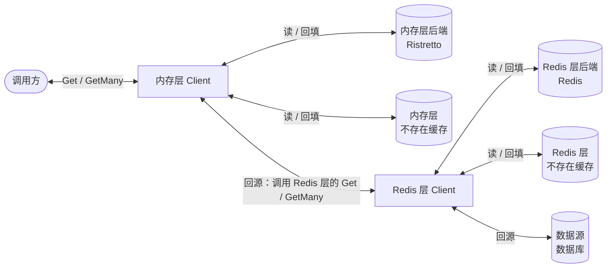
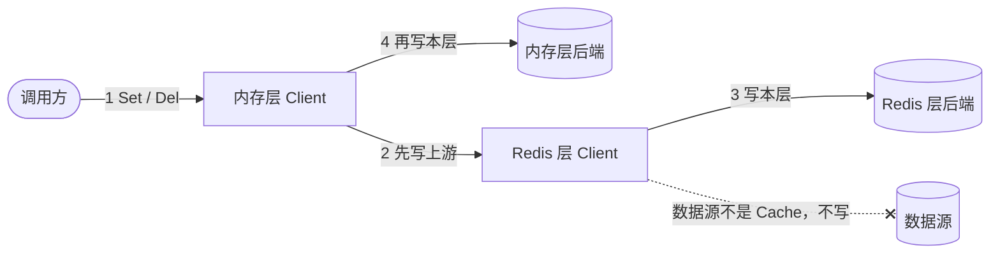

# cachex 设计总览

这里只写**现在成立**的设计。被推翻的做法直接删掉，理由放进 [ADR](adr/)。术语以 [GLOSSARY.md](../GLOSSARY.md) 为准。

## 一句话

cachex 是一个泛型的多层缓存客户端：每一层未命中时向上游取值，把同一个 key 的并发请求合并成一次回源，用新鲜/陈旧/腐烂三态和不存在缓存处理过期与不存在的 key，并保证写入在各层按同一顺序生效、回源不会把旧值回填到写入之后。

## 为什么需要它

直接「查缓存，没有就查数据库再回填」会遇到几类问题，cachex 分别用一个机制处理：

| 问题 | 现象 | 机制 |
|---|---|---|
| 缓存击穿 | 热点 key 过期的瞬间，大量请求同时打到数据源 | [合并回源](design/singleflight.md)（singleflight）+ [二次检查](design/read-path.md#二次检查) |
| 缓存穿透 | 查询根本不存在的 key，每次都打到数据源 | [不存在缓存](design/read-path.md#不存在缓存) |
| 过期时的等待 | 条目一过期，读请求就要同步等回源 | [返回陈旧值](design/read-path.md#返回陈旧值) |
| 旧值回填 | 写入刚完成，一个更早开始的回源把旧值写了回去 | [写入顺序与分片锁](design/write-order.md) |
| 多次往返 | 一次要读几百个 key，逐个回源太慢 | [批量读](design/batch.md) |

缓存雪崩（大量 key 同时过期）目前没有专门机制，见 [todo](todo.md) 第一条。

## 核心模型

```go
type Upstream[T any] interface { Get(ctx, key) (T, error) }          // 能取值的东西
type Cache[T any] interface { Upstream[T]; Set(...); Del(...) }        // 能存值的东西
type BatchUpstream[T any] interface { GetMany(ctx, keys) (map[string]T, error) } // 可选：能一次取多个
type BatchCache[T any] interface { Cache[T]; BatchUpstream[T]; SetMany(...); DelMany(...) } // 可选
```

- **一层 = 一个 `Client` + 它的后端（`Cache`）+ 它的上游（`Upstream`）**。
- `Client` 自己实现了 `Cache` 和 `BatchUpstream`，所以一个 `Client` 可以做另一个 `Client` 的上游，层就这样串起来。
- 上游如果也是 `Cache`，写入会继续往下传；到了不是 `Cache` 的上游（数据源）就停止。

## 架构总览

下面两张图都以「内存层 → Redis 层 → 数据库」这条三段链路为例。

**读取的数据流**：每条边都是双向的，去程是请求，回程是值、「不存在」或回填。



**写入的数据流**：编号就是先后顺序。



每一层内部的处理顺序都相同：

1. **查后端**，按新鲜度决定直接返回、返回陈旧值并后台刷新，还是继续往下走（[读取路径](design/read-path.md)）。
2. **未命中时查不存在缓存**，确认「已知不存在」就直接返回。
3. **合并回源**：同一个 key 只让一个请求去上游，其他请求等它的结果（[合并回源](design/singleflight.md)）。
4. **二次检查**之后**回源**，再**回填**本层；回填受分片锁保护，不会落在写入之后（[写入顺序](design/write-order.md)）。

## 配置项

`NewClient(backend, upstream, opts...)` 的选项：

| 选项 | 默认 | 作用 | 详见 |
|---|---|---|---|
| `WithStale(fn)` / `EntryWithTTL(fresh, stale)` | 一律新鲜（过期交给后端自己的 TTL） | 判断一个值是新鲜、陈旧还是腐烂 | [read-path.md](design/read-path.md#新鲜度) |
| `WithNotFound(cache, fn)` / `NotFoundWithTTL(cache, fresh, stale)` | 不启用 | 不存在缓存 | [read-path.md](design/read-path.md#不存在缓存) |
| `WithServeStale(bool)` | 关闭 | 返回陈旧值，并在后台刷新 | [read-path.md](design/read-path.md#返回陈旧值) |
| `WithDoubleCheck(mode)` | `DoubleCheckAuto` | 二次检查 | [read-path.md](design/read-path.md#二次检查) |
| `WithFetchTimeout(d)` | `DefaultFetchTimeout` = 60 秒 | 一次回源的超时；二次检查、写入失败后的清理也用它限时 | [singleflight.md](design/singleflight.md#回源用的-ctx) |
| `WithFetchConcurrency(n)` | `DefaultFetchConcurrency` = 1 | 同一个 key 的回源槽位数 | [singleflight.md](design/singleflight.md#回源槽位) |
| `WithGetManyFetchConcurrency(n)` | `DefaultGetManyFetchConcurrency` = 16 | 一次 `GetMany` 同时向上游发出的请求数 | [batch.md](design/batch.md#回源怎么发) |
| `WithGetManyChunkSize(n)` | 0（不分段） | 发往批量上游的每次调用最多多少个 key | [batch.md](design/batch.md#回源怎么发) |
| `WithLogger(l)` | `slog.Default()` | 日志 | — |

`WithFetchTimeout`、`WithFetchConcurrency`、`WithGetManyFetchConcurrency` 必须大于 0，`WithGetManyChunkSize` 不能为负，否则 `NewClient` 会 panic。后端自己的配置（TTL、`ChunkSize`、`KeyPrefix` 等）见 [backends.md](design/backends.md)。

## 分篇

| 文档 | 内容 |
|---|---|
| [design/read-path.md](design/read-path.md) | 一次 `Get` 的完整流程：新鲜度三态、不存在缓存、返回陈旧值、二次检查 |
| [design/singleflight.md](design/singleflight.md) | 合并回源：认领与发布、回源 ctx、panic 与 Goexit、回源槽位 |
| [design/write-order.md](design/write-order.md) | 写入顺序：先写上游、分片锁、写入代数、回填保护、摘除在途回源 |
| [design/batch.md](design/batch.md) | 批量读：流程、分段与并发、错误模型和三种结果 |
| [design/backends.md](design/backends.md) | 各后端的实现要点：Ristretto、SyncMap、Redis、GORM、BigCache、Transform |
| [design/consistency.md](design/consistency.md) | 一致性：单进程内保证什么、多实例的边界、TTL 的作用 |

## 其他文档

| 文档 | 内容 |
|---|---|
| [GLOSSARY.md](../GLOSSARY.md) | 术语表 |
| [adr/](adr/) | 架构决策记录 |
| [todo.md](todo.md) | 发现了但还没做的事 |
| [faq_ZH.md](faq_ZH.md) | 常见问题（英文版见 [faq.md](faq.md)） |
| [research/](research/README.md) | 实测与调研报告 |
| [../BENCHMARK.md](../BENCHMARK.md) | 性能基准（中英双语） |
