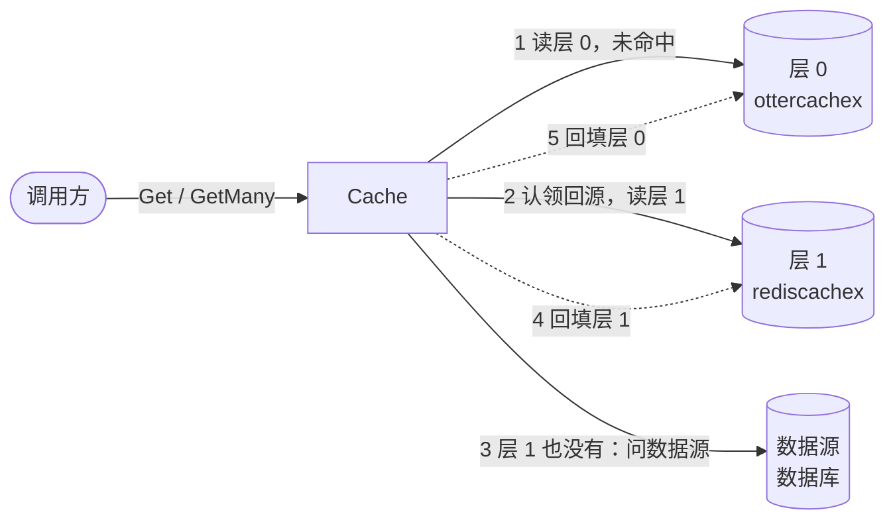
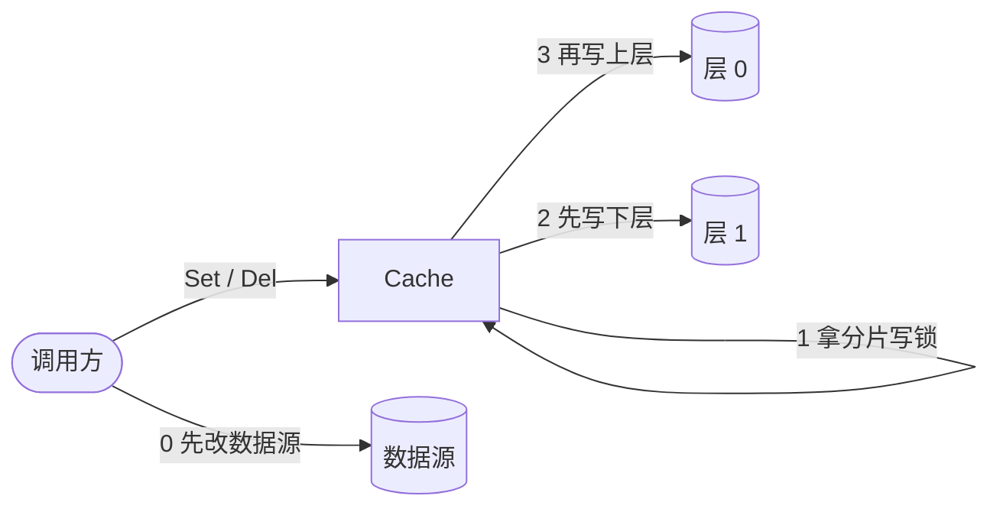

# cachex 设计总览

这里只写**现在成立**的设计。被推翻的做法直接删掉，理由放进 [ADR](adr/)。术语以 [GLOSSARY.md](../GLOSSARY.md) 为准。

## 一句话

cachex 是一个泛型的多层读穿缓存：一个缓存（`Cache[T]`）从上到下读它的各层，都没有可用条目时才问数据源；同一个 key 的并发未命中只回源一次，结果回填进上面那些没命中的层；条目按新鲜、陈旧、腐烂三态过期，「不存在」也作为条目记下；写入从最下层写到最上层，并保证回源不会把旧值回填到写入之后。

## 为什么需要它

直接「查缓存，没有就查数据库再回填」会遇到几类问题，cachex 分别用一个机制处理：

| 问题 | 现象 | 机制 |
|---|---|---|
| 缓存击穿 | 热点 key 过期的瞬间，大量请求同时打到数据源 | [合并回源](design/singleflight.md) + [二次检查](design/read-path.md#二次检查) |
| 缓存穿透 | 查询根本不存在的 key，每次都打到数据源 | [不存在记录](design/read-path.md#不存在记录) |
| 缓存雪崩 | 同时写入的大量条目在同一时刻一起过期 | [抖动](design/read-path.md#条目的寿命) |
| 过期时的等待 | 条目一过期，读请求就要同步等回源 | [返回陈旧值](design/read-path.md#返回陈旧值) |
| 旧值回填 | 写入刚完成，一个更早开始的回源把旧值写了回去 | [写入顺序与分片锁](design/write-order.md) |
| 多次往返 | 一次要读几百个 key，逐个回源太慢 | [批量读](design/batch.md) |

## 核心模型

```go
type Entry[T any] struct {           // 条目：后端里为一个 key 存的东西
    Value      T
    NotFound   bool                  // 不存在记录
    CachedAt   time.Time             // 数据源回答的时间
    FreshUntil time.Time             // 之后变陈旧
    ExpiresAt  time.Time             // 之后腐烂；后端用它做原生过期
}

type Backend[T any] interface {      // 后端：一层的存储，单 key 和批量方法都要有
    Get(ctx, key) (Entry[T], bool, error)
    GetMany(ctx, keys) (map[string]Entry[T], error)
    Set / SetMany / Del / DelMany
}

type Source[T any] interface { Get(ctx, key) (T, error) }                         // 数据源，不存在返回 ErrNotFound
type BatchSource[T any] interface { GetMany(ctx, keys) (map[string]T, error) }    // 可选：一次回答多个 key

func New[T any](source Source[T], layers []Layer[T], opts ...Option) *Cache[T]
func NewLayer[T any](backend Backend[T], opts ...LayerOption) Layer[T]
```

- **一个 `Cache` 管所有层**：`layers[0]` 最快、最先读，最后才是数据源。一个 key 只有一个在途回源、一套分片锁，见 [ADR 0012](adr/0012-one-cache-over-layers.md)。
- **条目由 `Cache` 计算**：用户类型只出现在 `T` 里；每层的新鲜期、陈旧期、不存在记录的寿命在 `NewLayer` 上配置，后端只负责存。
- **后端拆在子包里**：`ottercachex`（内存）、`bigcachex`（按字节存的内存）、`rediscachex`、`gormcachex`；测试用的 `cachextest`。见 [backends.md](design/backends.md)。

## 架构总览

下面两张图都以「内存层 → Redis 层 → 数据库」为例。

**读取的数据流**：实线是一次未命中走过的路，虚线是回填。



**写入的数据流**：编号就是先后顺序，数据源不写。



一次读取的处理顺序：

1. **读第一层**，新鲜就返回；陈旧就返回并后台刷新；腐烂或没有就往下走（[读取路径](design/read-path.md)）。
2. **合并回源**：同一个 key 只让一个请求往下走，其他请求等它的结果（[合并回源](design/singleflight.md)）。
3. 领头请求**二次检查**第一层，再**依次读下面各层**，都没有可用条目才**问数据源**。
4. 在分片读锁下把结果**回填**进上面那些层，然后发布给所有等待方；回填不会落在写入之后（[写入顺序](design/write-order.md)）。

## 配置项

`New(source, layers, opts...)` 的选项：

| 选项 | 默认 | 作用 | 详见 |
|---|---|---|---|
| `WithFetchTimeout(d)` | `DefaultFetchTimeout` = 60 秒 | 回源时每一次调用的超时：二次检查、读一层、问一次数据源（连同之后的回填）、写入失败后的失效 | [singleflight.md](design/singleflight.md#回源用的-ctx) |
| `WithFetchesPerKey(n)` | `DefaultFetchesPerKey` = 1 | 同一个 key 同时最多几个在途回源 | [singleflight.md](design/singleflight.md#每个-key-的回源数) |
| `WithGetManyConcurrency(n)` | `DefaultGetManyConcurrency` = 16 | 一次 `GetMany` 同时向数据源发出的请求数 | [batch.md](design/batch.md#回源怎么发) |
| `WithGetManyChunkSize(n)` | 0（不分段） | 发往批量数据源的每次调用最多多少个 key | [batch.md](design/batch.md#回源怎么发) |
| `WithMaxAge(func(T) time.Duration)` | 不限 | 按值给条目定寿命上限，在回源时调用一次；`T` 必须和 `Cache` 的一致，否则 `New` panic | [read-path.md](design/read-path.md#条目的寿命) |
| `WithDoubleCheck(mode)` | `DoubleCheckAuto` | 二次检查 | [read-path.md](design/read-path.md#二次检查) |
| `WithNow(f)` | `time.Now` | 时钟 | — |
| `WithLogger(l)` | `slog.Default()` | 不影响调用结果的失败（回填失败、后台刷新失败、失效失败）记在这里 | — |

`NewLayer(backend, opts...)` 的选项：

| 选项 | 默认 | 作用 |
|---|---|---|
| `TTL(fresh, stale)` | 必填，`fresh` 必须大于 0 | 值的新鲜期和之后的陈旧期 |
| `NotFoundTTL(fresh, stale)` | 0（这一层不记不存在） | 不存在记录的新鲜期和陈旧期 |
| `Jitter(ratio)` | `DefaultJitter` = 0.1 | 把新鲜期随机缩短最多这个比例，取值 `[0, 1)` |

非法的取值（超时、回源数、并发数不大于 0，分段为负，TTL 为负，抖动超出范围）都会让 `New` 或 `NewLayer` panic。

`Close()` 等待它之前启动的回源和后台刷新（包括它们的回填）结束，之后不再发起后台刷新；它不关闭后端，关闭之后读写照常可用。所以关闭后端之前先调用 `Close`。

## 分篇

| 文档 | 内容 |
|---|---|
| [design/read-path.md](design/read-path.md) | 一次 `Get` 的完整流程：条目的寿命、三态、不存在记录、返回陈旧值、二次检查、回填 |
| [design/singleflight.md](design/singleflight.md) | 合并回源：认领与发布、回源 ctx、panic 与 Goexit、每个 key 的回源数 |
| [design/write-order.md](design/write-order.md) | 写入顺序：先写下层、分片锁、写入代数、回填保护、摘除在途回源 |
| [design/batch.md](design/batch.md) | 批量读：流程、分段与并发、错误模型和三种结果 |
| [design/backends.md](design/backends.md) | 后端接口、编解码、各子包的实现要点 |
| [design/consistency.md](design/consistency.md) | 一致性：单进程内保证什么、多实例的边界、TTL 的作用 |

## 其他文档

| 文档 | 内容 |
|---|---|
| [GLOSSARY.md](../GLOSSARY.md) | 术语表 |
| [adr/](adr/) | 架构决策记录 |
| [todo.md](todo.md) | 发现了但还没做的事 |
| [faq_ZH.md](faq_ZH.md) | 常见问题（英文版见 [faq.md](faq.md)） |
| [research/](research/README.md) | 实测与调研报告 |
| [../BENCHMARK.md](../BENCHMARK.md) | 性能基准（中英双语） |
