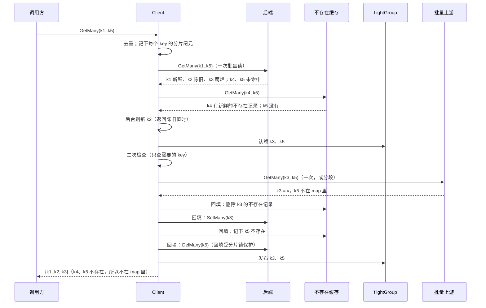

# 批量读

`Client.GetMany(ctx, keys)` 一次读多个 key。它的语义和**逐个调用 `Get`** 完全相同（新鲜度、不存在缓存、返回陈旧值、合并回源、二次检查、回填都照常生效），只是读后端、回源、回填都尽量合成批量调用。代码在 `batch.go`。

## 接口

```go
// 可选：能一次回答多个 key 的上游
type BatchUpstream[T any] interface {
    GetMany(ctx context.Context, keys []string) (map[string]T, error)
}

// 可选：能批量读写的后端
type BatchCache[T any] interface {
    Cache[T]
    BatchUpstream[T]
    SetMany(ctx context.Context, values map[string]T) error
    DelMany(ctx context.Context, keys []string) error
}

func (c *Client[T]) GetMany(ctx context.Context, keys []string) (map[string]T, error)
```

- 上游或后端没有实现批量接口时，自动退回逐个 key 调用，语义不变。
- `Client` 自己实现了 `BatchUpstream`，所以在 L1 → L2 → 数据源的链路里，一批 key 会以每层一次调用的方式一路传下去。

## 流程



逐步说明：

1. **去重**：重复的 key 只处理一次。
2. **读后端**：一次批量读。读到的每个值按新鲜度处理：新鲜的放进结果；陈旧的也放进结果（开启返回陈旧值时），同时这些 key 在后台合成一批刷新；腐烂的和未命中的继续往下走，后面查到的也放进同一份结果。**整份结果最后一次性返回。**
3. **查不存在缓存**：后端未命中的 key 一起查一次，规则同 `Get`。
4. **合并回源**：需要回源的 key 逐个在同一个 flightGroup 里认领。别人正在回源的 key 直接等结果，自己领头的 key 由自己回源。见 [singleflight.md](singleflight.md#批量认领)。
5. **二次检查**：只对需要的 key 再读一次本层（默认的 `DoubleCheckAuto` 下，只检查读取之后本 Client 写过其分片的 key）。
6. **回源**：见下一节。
7. **回填**：找到的值写进后端，不存在的 key 写进不存在缓存，并删掉后端的旧值。只写本层。

## 回源怎么发

| 上游 | 怎么发 | 每个请求的超时 | key 什么时候拿到结果 |
|---|---|---|---|
| 实现了 `BatchUpstream` | **一次** `GetMany`；设置了 `WithGetManyChunkSize(n)` 时，切成每段最多 n 个 key、并发执行 | 每段一个 `WithFetchTimeout`；上游是 `Client` 时为 `WithFetchTimeout` 加上下层的预算（见下文） | 这一段返回时，一起拿到 |
| 没有实现 | 每个 key 按单个 `Get` 的完整流程回源 | 每个 key 一个 `WithFetchTimeout` | 自己那个 key 回源完成时 |

两种情况的并发上限都是 `WithGetManyFetchConcurrency`（默认 16），它的含义是「一次 `GetMany` 同时向上游发出的请求数」。不要和 `WithFetchConcurrency` 混淆，后者是同一个 key 的回源槽位数。

**上游不支持批量时，key 轮到它才认领**。如果一开始就认领全部 key、再慢慢排队回源，一个普通 `Get` 碰上排在队尾的 key，就要等整个队列。逐个认领可以避免这种情况。另外，`GetMany` 的 ctx 一结束，就不再开始新的 key。

**分段的好处**：
- 上游限制了单次批量大小时（比如某个 RPC 一次最多接受 100 个 id），由库负责切分；
- 每一段返回时立即发布结果、立即回填，并且只锁这一段 key 的分片（见 [write-order.md](write-order.md#慢操作会拖慢多大范围)）；
- 某一段 panic 或调用 Goexit，只影响这一段还没拿到结果的 key。

**上游是另一个 Client 时的超时**：下层 Client 会给自己的每次回源各自限时，所以上层不能只给这次批量调用一个 `WithFetchTimeout`，否则下层还在排队的 key 会被上层的超时误判为失败。上层的上限是「本层的一个 `fetchTimeout`」加上「下层最多可能用的时间」：

```
下层预算(n) =
  下层逐 key 回源：fetchTimeout × (1 + ⌈n / 并发⌉)
  下层批量回源：  fetchTimeout + ⌈⌈n / 段大小⌉ / 并发⌉ × fetchTimeout
  下层又是 Client：fetchTimeout + ⌈⌈n / 段大小⌉ / 并发⌉ × 再下一层的预算(段大小)
```

这样基本不会误伤还在下层排队的 key（下层第一次读后端、二次检查的时间不在预算里），下层卡死时也不会无限期挂着。

## 错误模型

### 三种结果

每个 key 读完后，必然是下面三种之一。`Get` 和 `GetMany` 表达的是同一套，只是用了各自返回形式里最自然的方式：

| 结果 | `Get` | `GetMany` |
|---|---|---|
| 找到了（值本身可能是 `nil`） | `(value, nil)` | 在 map 里 |
| 不存在 | `IsErrKeyNotFound(err)` 为真 | 既不在 map 里，也不在 `BatchError` 里 |
| 失败了 | 其他 error | 列在 `BatchError.Errors` 里 |

- **不存在不算错误**：缓存的 `GetMany` 几乎每次都有未命中。如果把不存在也算进 `BatchError`，`err` 就几乎总是非 nil，调用方每次都得过滤一遍。这和 go-redis 的 `MGet`、`database/sql` 的 `Query`、Go map 的 `v, ok := m[k]` 是同一个思路。
- **值可以是 `nil`**：缓存的空指针也是命中。判断 key 在不在，要用 `v, ok := m[k]`，不能用 `m[k] == nil`。
- **返回的 map 总是包含所有成功的 key**，不管 `err` 是不是 nil。

### 批量上游要遵守的约定

实现 `BatchUpstream`（以及 `BatchCache` 的 `GetMany`）时：

| 返回 | 含义 |
|---|---|
| map 里有 key | 找到了 |
| map 里没有 key | 不存在。**不要**用 `ErrKeyNotFound` 表示 |
| 原样返回的 `*BatchError`（不要再包一层） | 部分失败：只有它列出的 key 失败，map 里照常放其余 key |
| 其他任何 error | **整批失败**：所有 key 都按失败处理 |

整批失败的 error，即使在错误链里包着 `ErrKeyNotFound`，也算所有 key 失败，不算不存在。实现上，cachex 会给每个 key 的错误包一层内部标记 `wholeBatchError`：`IsErrKeyNotFound` 遇到这个标记就返回 false，但 `errors.Is`/`errors.As` 仍然能找到原来的错误（比如连接错误）。只有**原样返回**的 `*BatchError` 才算部分失败，因为被包过一层或 join 过的 `BatchError`，旁边可能还有一个让整批失败的错误。

### 批量写

`BatchCache.SetMany`/`DelMany` 是**尽力而为**：每个 key 都尝试写，失败的 key 列在原样返回的 `*BatchError` 里；返回其他 error，表示不知道哪些 key 写成功了。Client 只在回填时用它们，失败只记 WARN 日志，因为多缓存一个 key，就少一次回源。见 [ADR 0005](../adr/0005-best-effort-batch-writes.md)。

为什么返回 `(map, error)` 而不是 `[]Result` 或 `map[string]Result`，见 [ADR 0004](../adr/0004-batch-result-shape.md)。

## 和单个 Get 的交互

- 一个 `Get` 和一个包含同一 key 的 `GetMany` 共用在途回源，只回源一次。
- `Get` 加入的如果是批量上游的那次批量回源，它要等这一次调用（或这一段）整体返回，才能拿到结果。
- 批量回源时，上游没有返回某个 key，那么等待这个 key 的 `Get` 拿到的是普通的 `ErrKeyNotFound`（不带 `Cached`），而不是下层不存在缓存的那种。
