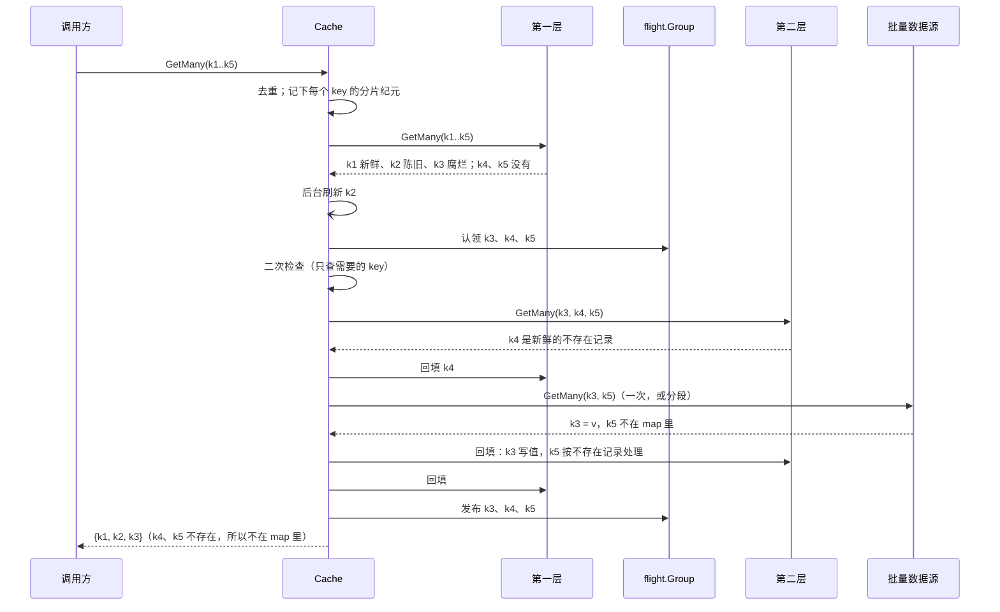

# 批量读

`Cache.GetMany(ctx, keys)` 一次读多个 key。它的语义和**逐个调用 `Get`** 相同（条目三态、不存在记录、返回陈旧值、合并回源、二次检查、回填都照常生效），只是每一层、数据源都尽量合成一次调用。代码在 `read.go`。

## 接口

```go
// 可选：能一次回答多个 key 的数据源
type BatchSource[T any] interface {
    GetMany(ctx context.Context, keys []string) (map[string]T, error)
}

func (c *Cache[T]) GetMany(ctx context.Context, keys []string) (map[string]T, error)
```

- 后端必须实现批量方法（见 [backends.md](backends.md#后端接口)），所以每一层总是一次调用。
- 数据源没有实现 `BatchSource` 时，逐个 key 调用它的 `Get`，语义不变。
- `Cache` 自己的 `Get`、`GetMany` 签名和 `Source`、`BatchSource` 一致，可以拿一个 `Cache` 做另一个 `Cache` 的数据源；但同一组层应当放进同一个 `Cache`，那样才共用合并回源和分片锁。

## 流程



逐步说明：

1. **去重**：重复的 key 只处理一次，每层也只收到一次。
2. **读第一层**：一次 `GetMany`。新鲜的放进结果；陈旧的也放进结果，同时这些 key 在后台合成一批刷新；腐烂的和没有的继续往下走，后面查到的也放进同一份结果。**整份结果最后一次性返回。** 第一层整体读失败时，所有 key 都按失败处理，不往下走。
3. **合并回源**：未命中的 key 全部当场认领。别人正在回源的 key 直接等结果，自己领头的 key 交给一个回源 goroutine。见 [singleflight.md](singleflight.md#批量认领)。
4. **二次检查**：只对需要的 key 再读一次第一层（默认的 `DoubleCheckAuto` 下，只检查读取之后本 `Cache` 写过其分片的 key）。
5. **读下面各层**：每层一次调用（只剩一个 key 时用 `Get`）。可用的 key 立刻回填它上面的层并发布，其余的继续往下。
6. **问数据源**：见下一节。
7. **回填并发布**：每次数据源调用返回后，马上回填它这些 key，再发布。

## 回源怎么发

| 数据源 | 怎么发 | 每个请求的超时 | key 什么时候拿到结果 |
|---|---|---|---|
| 实现了 `BatchSource` | 一次 `GetMany`；设置了 `WithGetManyChunkSize(n)` 时，切成每段最多 n 个 key、并发执行 | 每段一个 `WithFetchTimeout`，覆盖这次调用和随后的回填 | 这一段返回时，一起拿到 |
| 没有实现 | 每个 key 一次 `Get`，并发执行 | 每个 key 一个 `WithFetchTimeout` | 自己那个 key 返回时 |

两种情况的并发上限都是 `WithGetManyConcurrency`（默认 16），它的含义是「一个回源 goroutine 同时向数据源发出的请求数」。不要和 `WithFetchesPerKey` 混淆，后者是同一个 key 同时最多几个在途回源。

只剩一个 key 要问数据源时，总是用 `Get`，即使数据源实现了 `BatchSource`。

**未命中的 key 一次全部认领**，这样下面各层才能每层一次调用读完。代价是：数据源不支持批量时，一个普通 `Get` 碰上 `GetMany` 里还在排队的 key，要等它轮到才拿到结果。需要避免这种等待时，让数据源实现 `BatchSource`。

**分段的好处**：
- 数据源限制了单次批量大小时（比如某个 RPC 一次最多接受 100 个 id），由库负责切分；
- 每一段返回时立即回填、立即发布，并且只锁这一段 key 的分片（见 [write-order.md](write-order.md#慢操作会拖慢多大范围)）；
- 某一段 panic 或调用 Goexit，只影响这一段还没拿到结果的 key。

**等待方的取消**：`GetMany` 的 ctx 一结束，还没拿到结果的 key 都按 `context done while fetching` 失败；回源照常进行，结果照样回填。

## 错误模型

### 三种结果

每个 key 读完后，必然是下面三种之一。`Get` 和 `GetMany` 表达的是同一套，只是用了各自返回形式里最自然的方式：

| 结果 | `Get` | `GetMany` |
|---|---|---|
| 找到了（值本身可能是 `nil`） | `(value, nil)` | 在 map 里 |
| 不存在 | `errors.Is(err, cachex.ErrNotFound)` | 既不在 map 里，也不在 `BatchError` 里 |
| 失败了 | 其他 error | 列在 `BatchError.Errors` 里 |

- **不存在不算错误**：缓存的批量读几乎每次都有未命中。如果把不存在也算进 `BatchError`，`err` 就几乎总是非 nil，调用方每次都得过滤一遍。
- **值可以是 `nil`**：缓存的空指针也是命中。判断 key 在不在，要用 `v, ok := m[k]`，不能用 `m[k] == nil`。
- **返回的 map 总是包含所有成功的 key**，不管 `err` 是不是 nil。

### 批量调用要遵守的约定

实现 `BatchSource.GetMany` 和后端的 `GetMany`/`SetMany`/`DelMany` 时：

| 返回 | 含义 |
|---|---|
| map 里有 key | 找到了 |
| map 里没有 key | 不存在（不要用 `ErrNotFound` 表示） |
| 原样返回的 `*BatchError`（不要再包一层） | 部分失败：只有它列出的 key 失败，map 里照常放其余 key |
| 其他任何 error | **整批失败**：所有 key 都按失败处理 |

只有**原样返回**的 `*BatchError` 才算部分失败，因为被包过一层或 join 过的 `BatchError`，旁边可能还有一个让整批失败的错误。整批失败的 error 里如果包着 `ErrNotFound`，`errors.Is` 会认出来，这是实现方的错误用法：不存在只能用「不在 map 里」表示。

### 批量写

后端的 `SetMany`/`DelMany` 是**尽力而为**：每个 key 都尝试写，失败的 key 列在原样返回的 `*BatchError` 里；返回其他 error，表示不知道哪些 key 写成功了。回填时它们失败只记 WARN 日志；写入时失败的 key 按 [write-order.md](write-order.md#失败时) 处理。见 [ADR 0005](../adr/0005-best-effort-batch-writes.md)。

为什么返回 `(map, error)` 而不是 `[]Result` 或 `map[string]Result`，见 [ADR 0004](../adr/0004-batch-result-shape.md)。

## 和单个 Get 的交互

- 一个 `Get` 和一个包含同一 key 的 `GetMany` 共用在途回源，只回源一次。
- `Get` 加入的如果是批量数据源的那次调用，它要等这一次调用（或这一段）整体返回，才能拿到结果。
