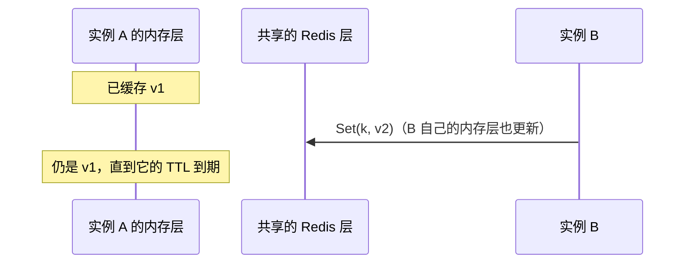
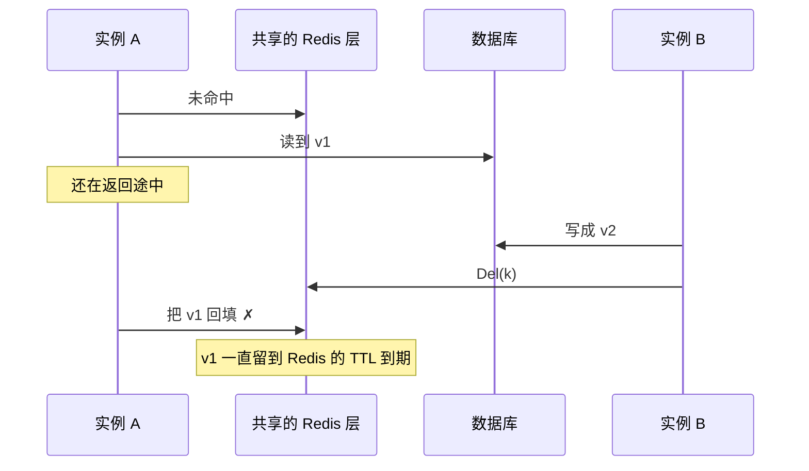
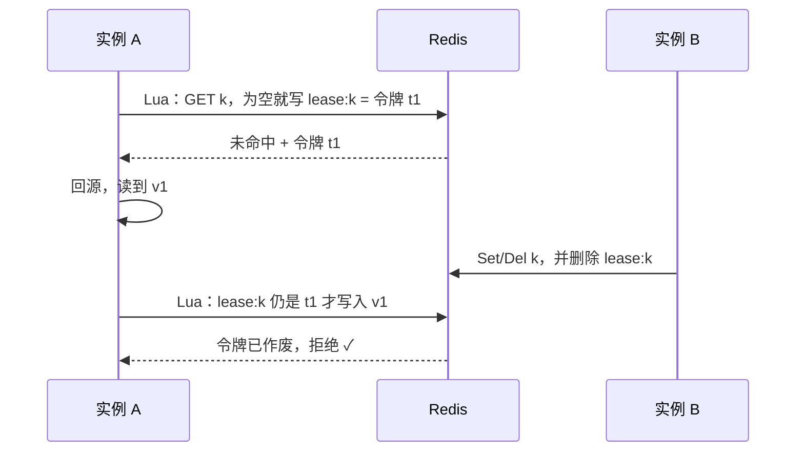

# 一致性

cachex 在**一个进程**内保证写入顺序；跨进程（多个实例共用 Redis 或数据库）的新鲜度，目前靠 TTL 兜底。这篇说明边界在哪里、TTL 该怎么设，以及以后可以怎么补。

## 单个进程内保证什么

前提：通过**同一个 `Cache`** 调用 `Set`/`Del`，并且先改数据源、再调用它们（见 [write-order.md](write-order.md#使用方式改数据源时要做什么)）。

| 保证 | 靠什么 |
|---|---|
| `Set`/`Del` 返回后，这个进程的读取不会再拿到写入前的值 | 分片锁 + 写入代数（挡住旧值回填）、摘除在途回源（挡住加入更早的回源） |
| 新值不会先于下层出现在上层 | 先写下层、再写上层 |
| 同一个 key 的并发写入，在各层以同一顺序生效 | 同一分片的写入串行执行 |
| 写入失败时，失败的层及其上面不会留下这个 key 的条目 | 失败后从这些层删掉它 |

**不保证**的情况：写入**进行中**，上层落下之前，并发的读取仍可能读到旧值。`Set`/`Del` 一返回，这个窗口就关闭了。

## 多个实例时不保证什么

分片锁和在途回源的登记都在一个 `Cache` 的内存里，其他实例对它们一无所知。

### 1. 其他实例的内存层

实例 B 的写入不会碰实例 A 的内存。A 会一直返回旧值，直到 A 内存层里这个条目过期。

**缓解**：内存层的 TTL 不要超过你能接受的旧数据时长。需要更快失效时，在业务代码里广播变更（例如 Redis Pub/Sub），收到消息的实例直接调用自己内存后端的 `Del` 删掉这个 key。

### 2. 旧值回填进共享层

A 的分片锁不知道 B 写过，所以挡不住这次回填。共享层上的 `Cache` 相当于各实例各有一个，它们之间没有协调。这是 cache-aside 模式的经典竞态：

- **概率低**：读和写要在几毫秒内交错；
- **后果持续久**：旧值会存活整个共享层的 TTL。

**缓解**：共享层的 TTL 也要设成你能接受的旧数据时长。

## TTL 怎么设

这里的 TTL 指每层 `TTL(fresh, stale)` 的总和，也就是条目在这一层最多存活多久。后端按 `ExpiresAt` 原生过期，不需要另外配置。

| 层 | 建议 |
|---|---|
| 内存层 | 不超过「其他实例可以容忍看到旧值多久」。通常是秒级到分钟级 |
| 共享层（Redis、数据库） | 不超过「旧值回填后可以容忍存活多久」。数据改动频繁、又在意新鲜度时，不宜设成小时级 |

## 以后可以怎么补

两项都记在 [todo](../todo.md) 里，暂不实现的理由见 [ADR 0011](../adr/0011-cross-instance-consistency-via-ttl.md)。

### Redis 租约（lease）

思路和进程内的写入代数相同，只是把「写入发生过」这个事实放到所有实例共享的 Redis 里：

- 读和领租约必须在同一个原子操作里，否则 B 可能恰好插在两步之间。
- 它同时能做**跨实例的回源去重**：别的实例看到已有租约，就等待或返回陈旧值，不再回源。
- 不需要数据源提供版本号；往返次数不变。

### 失效广播

写入后在一个频道上发布被改动的 key，其他实例收到后删除自己内存层里的这些 key。断线期间的消息会丢，所以 TTL 仍然是最后的兜底。
