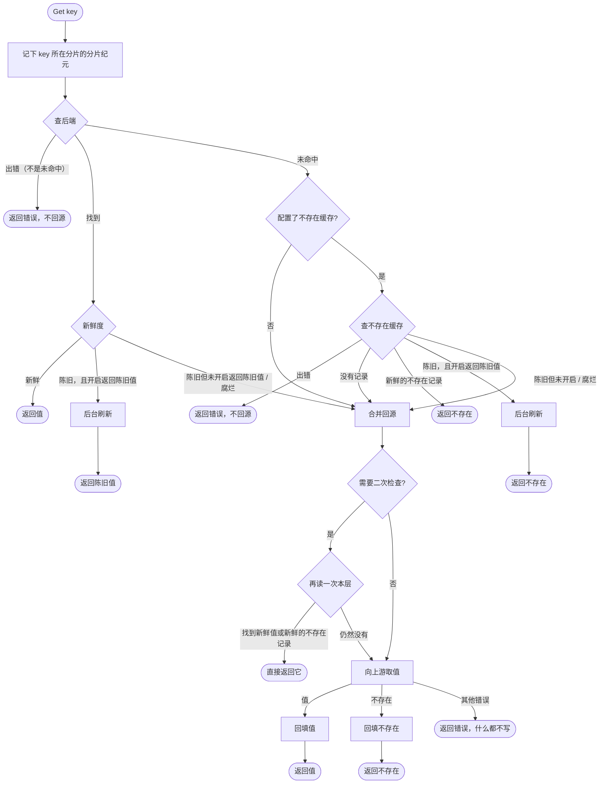
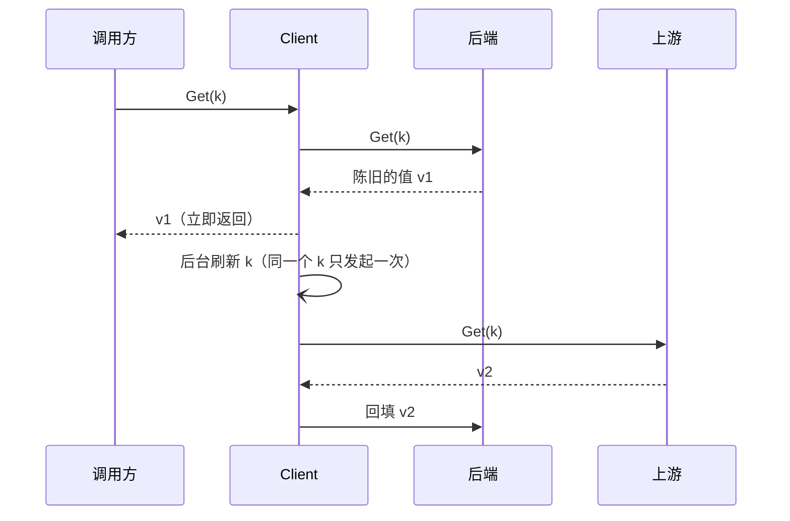
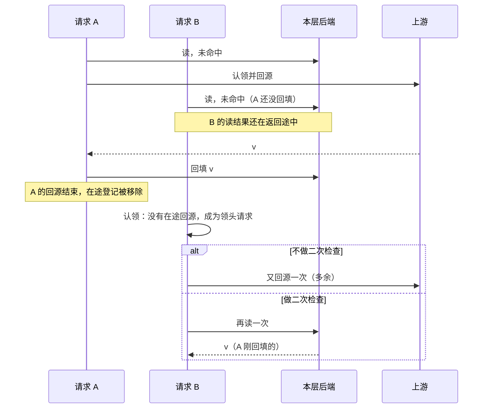
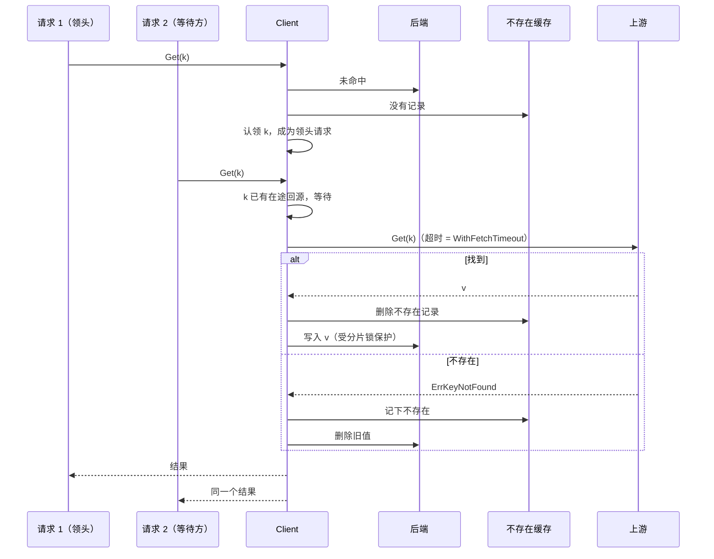

# 读取路径

一次 `Client.Get(ctx, key)` 在**一层**里怎么走。多层时，每一层都按同样的流程处理，它的回源就是调用下一层的 `Get`。批量读见 [batch.md](batch.md)，合并回源的细节见 [singleflight.md](singleflight.md)，回填保护见 [write-order.md](write-order.md)。

## 总流程

几个容易忽略的点：

- **后端或不存在缓存读失败时，不会回源**，而是直接返回错误。理由是：这一层出了故障时把流量全部转给上游，很容易把上游也压垮。
- **只有后端未命中时才查不存在缓存**。后端里有一个腐烂的值时，会直接回源。
- **上游返回其他错误时，什么都不写**。错误会交给这次回源的所有等待方，但不会被缓存，下一次读取会重新回源。

## 新鲜度

每个值是新鲜、陈旧还是腐烂，由 `WithStale(func(T) State)` 判断。不配置时一律算新鲜，过期完全交给后端自己的 TTL。

最常用的是 `Entry[T]` 加上 `EntryWithTTL(freshTTL, staleTTL)`。`Entry` 记录了取值的时间 `CachedAt`：

| 条目的年龄 | 状态 |
|---|---|
| `[0, freshTTL)` | 新鲜 |
| `[freshTTL, freshTTL + staleTTL)` | 陈旧 |
| `≥ freshTTL + staleTTL` | 腐烂 |

也可以自定义判断逻辑，比如根据值里的版本字段。后端自己的 TTL（`RistrettoCacheConfig.TTL`、`RedisCacheConfig.TTL`）是硬性上限：到期后条目直接消失，相当于未命中。所以后端的 TTL 应该不小于 `freshTTL + staleTTL`，否则陈旧期还没到，条目就已经没了。

## 不存在缓存

上游明确回答「不存在」（返回 `ErrKeyNotFound`，批量时是 map 里没有这个 key）时，回填会：

- 在不存在缓存里记下当前时间；
- 删掉后端里这个 key 的旧值。

不存在记录同样分新鲜、陈旧、腐烂三态，由 `NotFoundWithTTL(cache, freshTTL, staleTTL)` 或 `WithNotFound(cache, checkStale)` 配置。`staleTTL` 为 0 时没有陈旧期。

读到新鲜的不存在记录时，返回的 `ErrKeyNotFound` 带有 `Cached: true` 和 `CacheState`，调用方可以借此区分「刚从上游确认不存在」和「缓存里记着不存在」。

回填值的时候，会先删掉这个 key 的不存在记录，再写值，避免两者同时存在。

## 返回陈旧值

开启 `WithServeStale(true)` 后，读到陈旧的值或不存在记录时：

1. 立即返回它；
2. 在后台为这个 key 发起一次**刷新**。

刷新按 key（准确地说是按回源槽位）去重：同一个 key 的刷新还没结束时，不会再发起第二次。刷新走的是正常的合并回源流程，所以它会和同一时刻的前台回源合并成一次。刷新用的 ctx 去掉了调用方的取消，调用方返回之后刷新仍会继续。

## 二次检查

### 它解决的窗口

合并回源只能合并**同一时刻**的请求。下面这个请求就会漏掉：

窗口的大小大约是「本层一次读取的响应时间 × 这个 key 每单位时间的请求数」。后端是内存时，窗口几乎为零；后端是远程的 Redis 或数据库、key 又很热时，就很明显。实测数据见 [research/2026-10-double-check.md](../research/2026-10-double-check.md)：后端读取延迟 1ms 时，开启二次检查少打了约 40% 的上游。

### 三种模式

| 模式 | 行为 |
|---|---|
| `DoubleCheckAuto`（默认） | 只有在本请求读后端之后、本 Client 往这个 key 所在的分片写过东西（写入或回填），才再读一次 |
| `DoubleCheckEnabled` | 每次回源前都再读一次 |
| `DoubleCheckDisabled` | 从不再读 |

`Auto` 的依据是：二次检查只有在「读取之后有人往本层写了东西」时才可能读到不一样的结果；没人写过，再读也只是同样的未命中。所以请求在读后端**之前**先记下分片纪元，认领时比较一次。分片纪元变了才再读，没变就直接回源。

- 热点 key：前一次回源的回填会让分片纪元变化，后来的请求就会二次检查，收益和 `Enabled` 几乎一样。
- 冷 key 和不存在的 key：期间没有任何写入，跳过二次检查，成本和 `Disabled` 几乎一样。
- 误判：别的 key 和它落在同一个分片，并且恰好被写过，就会多读一次。这只是多一次读取，不会少读一次该读的。
- 看不到其他进程写入共享层的值。需要这一点时用 `Enabled`。

决策过程见 [ADR 0008](../adr/0008-on-demand-double-check.md)。

### 二次检查的细节

- 二次检查和回源都在认领之后执行，用的是**脱离了领头请求取消**的 ctx（见 [singleflight.md](singleflight.md#回源用的-ctx)），并且受 `WithFetchTimeout` 限制。
- 二次检查只接受**新鲜**的值或**新鲜**的不存在记录。读到陈旧的值、读失败，都照常回源。
- 回源的超时从二次检查结束之后开始计算，二次检查花掉的时间不会挤占回源的时间。

## 回源与回填

- 回填只写**本层**，不会写上游。上游自己的回填由上游那一层负责。
- 回填受分片锁和写入代数保护：如果回源期间这个 key 发生过 `Set`/`Del`，或者此刻正在写，这次回填就跳过，结果照常返回。详见 [write-order.md](write-order.md)。
- 回填时某一步失败（比如不存在缓存写不进去），另一步照样执行，失败只记 WARN 日志。删除旧值这一步尤其不能省：上游已经确认不存在了，旧值必须删掉。
