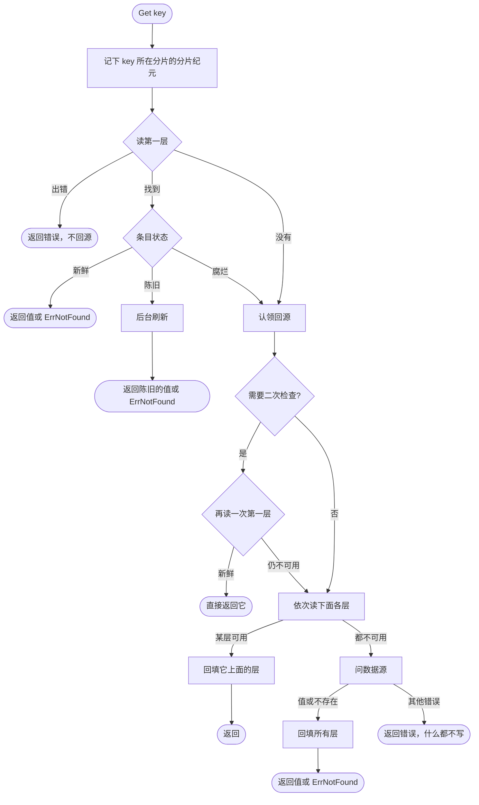
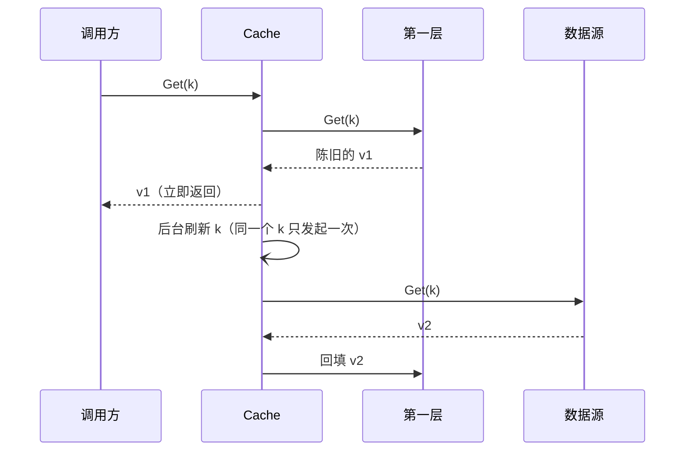
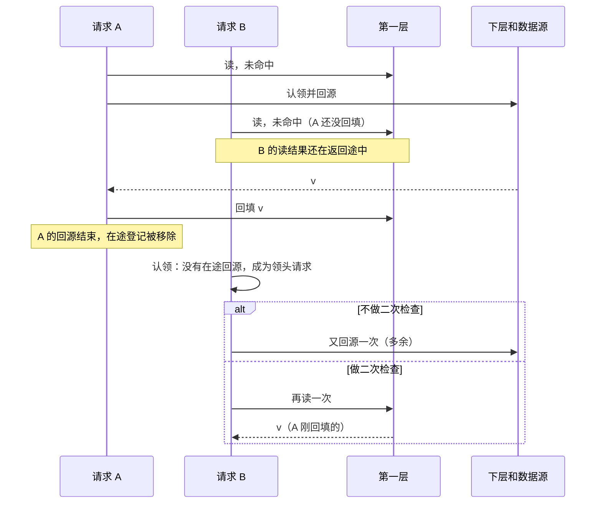
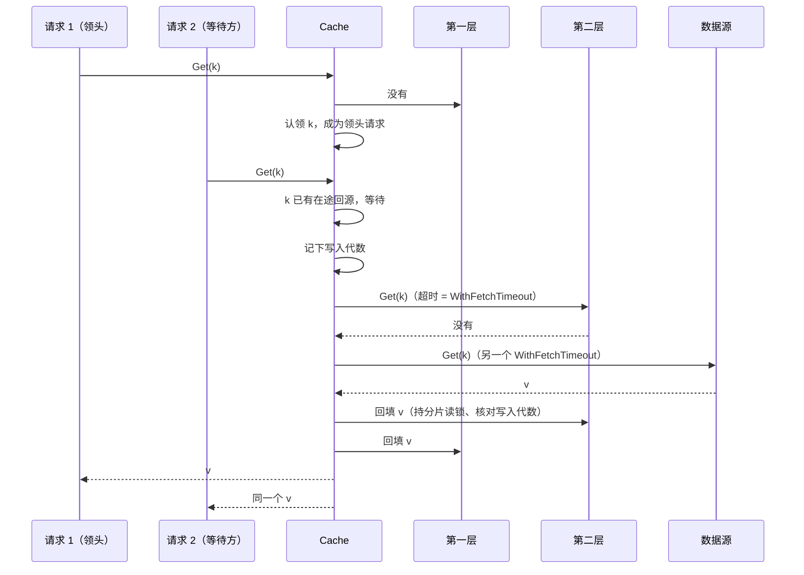

# 读取路径

一次 `Cache.Get(ctx, key)` 怎么走。批量读见 [batch.md](batch.md)，合并回源的细节见 [singleflight.md](singleflight.md)，回填保护见 [write-order.md](write-order.md)。代码在 `read.go`、`layer.go`。

## 总流程



几个容易忽略的点：

- **任何一层读失败，都不会继续往下回源**，而是返回错误。理由是：一层出了故障时把流量全部转给下层和数据源，很容易把它们也压垮。
- **数据源返回其他错误时，什么都不写**。错误会交给这次回源的所有等待方，但不会被缓存，下一次读取会重新回源。
- **命中第一层是快路径**：不分配内存，只读一次时钟、算一次分片纪元。

## 条目的寿命

每个条目记着三个时间，都由 `Cache` 在写入一层时算好（`Layer.entry`）：

| 字段 | 含义 |
|---|---|
| `CachedAt` | 数据源回答的时间 |
| `FreshUntil` | 之前是新鲜的 |
| `ExpiresAt` | 之后腐烂，不再返回；后端用它做原生过期 |

一层的配置是 `TTL(fresh, stale)`（值）和 `NotFoundTTL(fresh, stale)`（不存在记录），再加上 `Jitter(ratio)`。从数据源拿到一个回答时：

```
fresh' = fresh − rand[0, ratio) × fresh      // 抖动只缩短，不延长
FreshUntil = CachedAt + fresh'
ExpiresAt  = FreshUntil + stale              // 陈旧期跟在新鲜期后面
```

再按两个上限截短：

- **寿命上限**：配置了 `WithMaxAge(f)` 时，回源拿到值的那一刻调用一次 `f(value)`，各层的 `ExpiresAt`、`FreshUntil` 都不晚于 `CachedAt + f(value)`。`f` 返回 0 或负数时，这个值不缓存。用于自带过期时间的值，比如 token。
- **不比下层更新鲜、更长寿**：从下层复制到上层的条目，`CachedAt` 不变，上层的 `FreshUntil`、`ExpiresAt` 都不晚于下层那个条目的。所以年龄不会在每层重新计时，换一层也不会让旧数据多活一段。

算出来已经腐烂的条目不写入，改为删除这一层的这个 key。

| 读取时刻 | 状态 |
|---|---|
| 早于 `FreshUntil` | 新鲜 |
| `[FreshUntil, ExpiresAt)` | 陈旧 |
| 不早于 `ExpiresAt` | 腐烂（等于没有） |

因为后端用 `ExpiresAt` 做原生过期，不需要再单独给后端配置 TTL。

## 不存在记录

数据源明确回答「不存在」（`Get` 返回 `ErrNotFound`，或包着它的错误；批量时 map 里没有这个 key）时，回填会：

- 在配置了 `NotFoundTTL` 的层写入一条 `NotFound` 条目；
- 在没有配置的层**删掉**这个 key（旧值不能留下）。

读到新鲜或陈旧的不存在记录时，`Get` 返回 `ErrNotFound`，和数据源刚回答的不存在没有区别；`GetMany` 里这个 key 不出现。

## 返回陈旧值

层的陈旧期大于 0，就会返回陈旧条目：

1. 立即返回它（值或 `ErrNotFound`）；
2. 在后台为这个 key 发起一次**刷新**。

刷新按 key 去重：同一个 key 的刷新还没结束时，不会再发起第二次。刷新走正常的合并回源，所以会和同一时刻的前台回源合并成一次；它用的 ctx 去掉了调用方的取消。刷新时**下层的陈旧条目不算数**，要么找到新鲜的条目，要么问数据源。刷新失败（不包括「不存在」）记一条 ERROR 日志，陈旧的条目保留。`Close` 之后不再发起刷新。



下层的陈旧条目同样会被返回：第一层没有、第二层陈旧时，返回第二层的条目，把它回填进第一层，再后台刷新。

## 二次检查

### 它解决的窗口

合并回源只能合并**同一时刻**的请求。下面这个请求就会漏掉：



窗口的大小大约是「第一层一次读取的响应时间 × 这个 key 每单位时间的请求数」。第一层是内存时，窗口几乎为零；第一层是远程的 Redis、key 又很热时，就很明显。实测数据见 [research/2026-10-double-check.md](../research/2026-10-double-check.md)。

### 三种模式

| 模式 | 行为 |
|---|---|
| `DoubleCheckAuto`（默认） | 只有在本请求读第一层之后、本 `Cache` 往这个 key 所在的分片写过东西（写入或回填），才再读一次 |
| `DoubleCheckEnabled` | 每次都再读一次 |
| `DoubleCheckDisabled` | 从不再读 |

`Auto` 的依据是：只有「读取之后有人写了东西」，再读才可能读到不一样的结果。所以请求在读第一层**之前**先记下分片纪元，认领后比较一次，变了才再读。这个时机不能挪到读之后：远程的第一层读一次要零点几毫秒，回填恰恰可能发生在这段时间里。

- 热点 key：前一次回源的回填会让分片纪元变化，后来的请求就会二次检查，收益和 `Enabled` 几乎一样。
- 冷 key 和不存在的 key：期间没有任何写入，跳过二次检查，成本和 `Disabled` 几乎一样。
- 误判：别的 key 和它落在同一个分片、并且恰好被写过，就会多读一次。这只是多一次读取，不会少读一次该读的。
- 看不到**其他进程**写进共享层的值。需要这一点时用 `Enabled`。

决策过程见 [ADR 0008](../adr/0008-on-demand-double-check.md)。

### 二次检查的细节

- 二次检查在认领之后执行，用的是回源的共享 ctx（见 [singleflight.md](singleflight.md#回源用的-ctx)），并且受 `WithFetchTimeout` 限制。
- 只接受**新鲜**的条目（值或不存在记录）。读到陈旧的条目、读失败，都照常往下走。
- 只检查第一层：下面各层本来就是接下来要读的。

## 回源与回填



- **先回填，再发布**：等待方拿到结果时，回填已经写进去了，紧接着的读会命中。
- 回填**从下往上**写：先写离数据源近的层，再写上面的层，和写入顺序一致。
- 回填只写**找到结果的那一层上面**的层：第二层命中，就只回填第一层。
- 回填受分片锁和写入代数保护：回源期间这个 key 发生过写入，或者此刻正在写，这次回填就跳过，结果照常返回。详见 [write-order.md](write-order.md)。
- 回填某一层失败，只记 WARN 日志，其他层照写，结果照常返回。
- 每次调用（读一层、问数据源）各自受 `WithFetchTimeout` 限制；回填和它之前的那次调用共用一个超时。
