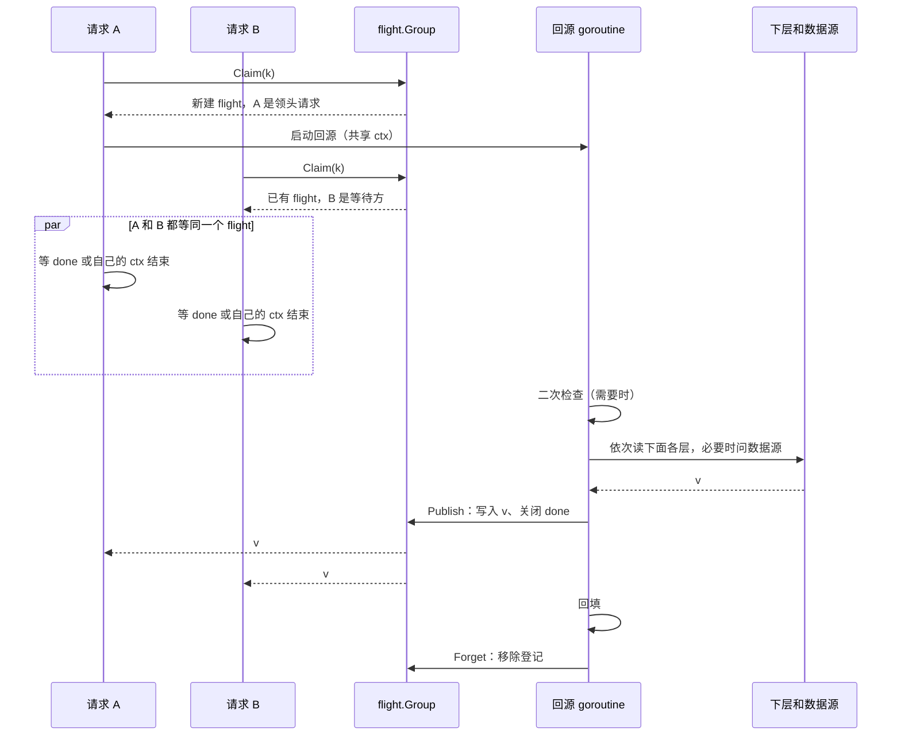
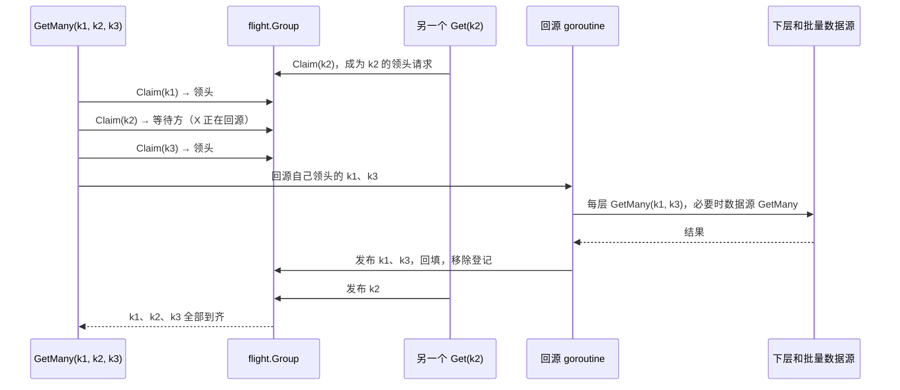

# 合并回源（singleflight）

同一个 key 的并发未命中只回源一次：第一个请求**认领**这个 key、成为**领头请求**，其他请求成为**等待方**，等它**发布**结果。`Get`、`GetMany` 和后台刷新共用同一套登记，所以它们之间也只回源一次。一个 `Cache` 只有一套登记，覆盖它的所有层：最上层未命中才认领，之后读下面各层、问数据源都由领头请求一次完成。

实现分两部分（为什么不用 `golang.org/x/sync/singleflight`，见 [ADR 0001](../adr/0001-own-flight-group.md)）：

- `internal/flight`：通用的登记表 `flight.Group`，只管「认领、发布、移除、摘除」；
- `read.go` 里的 `claimed`：cachex 自己的一层，保证每个在途回源恰好发布一次（见下文「panic 与 Goexit」）。

`internal/flight` 是内部包，暂不对外公开，以后有别的库需要时再考虑挪出去。

## 数据结构

```go
// package flight
type Flight[T any] struct {
    done  chan struct{} // 发布时关闭；对外是 Done()
    value T             // 对外是 Result()
    err   error
}

type Group[K comparable, T any] struct {
    mu      sync.Mutex
    flights map[K]*Flight[T]
}

// package cachex
type flightKey struct {
    key  string
    slot int // 见「每个 key 的回源数」
}
```

| 操作 | 做什么 | 谁调用 |
|---|---|---|
| `Claim(k)` | 有在途回源就返回它（调用方成为等待方），没有就新建并返回「你是领头请求」。**当场**给出答案，不阻塞 | 每个要回源的请求 |
| `Publish(f, value, err)` | 写入结果、关闭 `done`；**仍留在登记里** | 领头请求，每个在途回源恰好一次 |
| `Forget(k, f)` | 从登记中移除，只在登记的仍是 `f` 时才移除 | 领头请求，回填完成之后 |
| `Drop(k)` | 从登记中移除，但不发布结果、不打断回源 | 写入，见 [write-order.md](write-order.md#摘除在途回源) |
| `Finish(k, f, value, err)` | `Forget` 加 `Publish`，不需要回填时用 | — |

「只在登记的仍是 `f` 时才移除」很重要：一个被写入摘除的回源结束时，登记里可能已经是写入之后新建的回源，不能把它删掉。

## 发布与移除

一次回源的结果**先发布、再回填、最后移除登记**：

1. 数据源（或某一层）一回答，就 `Publish`：所有等待方立即拿到结果，不用等各层写完。
2. 然后在分片读锁下回填上面的层（见 [write-order.md](write-order.md)）。
3. 回填完成后 `Forget`。

在第 1 步和第 3 步之间来读这个 key 的请求，第一层还是未命中，于是认领；登记里的回源还在，它就加入这个**已经有答案**的回源，当场拿到同一个结果，不会再回源一次。第 3 步之后来的请求，读第一层就能命中。

这不会让写入之后的读拿到旧结果：写入会摘除（`Drop`）这个 key 的在途回源，之后的读找不到它，只能重新回源；被摘掉的回源的回填也因为写入代数变了而跳过（见 [write-order.md](write-order.md#摘除在途回源)）。

不需要回填的结果（出错、二次检查直接找到的值）发布后立即移除。回源 goroutine 结束时，会把它负责的所有登记都移除一遍，保证 panic 或 Goexit 时也不会留下登记。

代价是：`Get` 返回时，各层不一定已经写好这个值；紧接着直接读后端可能读不到。`Close` 会等回填完成。

## 单个 key 的时序



领头请求本身**不在自己的 goroutine 里回源**。回源由一个单独的 goroutine 执行，领头请求和其他等待方一样等结果。这样领头请求的 ctx 结束时，它可以立刻返回，回源仍然继续，为其他等待方服务。这个 goroutine 如果在 `Close` 之前启动，`Close` 会等它连同回填一起结束。

## 等待方的取消

每个等待方只等两件事：`done` 关闭，或者**自己的** ctx 结束。

- ctx 先结束：返回 `cachex: context done while fetching "k": …`（包着 ctx 的错误），不影响回源本身。
- 两者同时就绪时，Go 的 `select` 会随机选一个。所以等到之后还会再非阻塞地检查一次 `done`：只要结果已经在了，就用结果，不会把已经到手的结果丢掉、改报取消错误。`Get` 和 `GetMany` 都是这样。

## 回源用的 ctx

一次回源服务的是所有等待方，不只是领头请求。所以回源 goroutine 用的 ctx 是：

- **保留**领头请求 ctx 里的值（trace、日志字段等）；
- **去掉**它的取消和截止时间（`context.WithoutCancel`）：领头请求放弃了，回源仍然继续；
- **打上共享标记**：`cachex.IsShared(ctx)` 为真。后端据此不使用调用方的状态，比如 `gormcachex` 不加入 `WithTx` 放进来的事务，回填不能写进某一个调用方的事务里。

在这个 ctx 之上，每次调用各自受 `WithFetchTimeout` 限制：二次检查、读每一层、问每一次数据源（连同随后的回填）。

决策过程见 [ADR 0007](../adr/0007-detached-fetch-context.md)。

## panic 与 Goexit

数据源可能 panic，也可能调用 `runtime.Goexit`（例如测试里在数据源函数中调用 `t.FailNow`）。不管哪种情况，**每个在途回源都恰好发布一次结果**，等待方不会永远挂着：

| 数据源的行为 | 等待方拿到的结果 | 日志 |
|---|---|---|
| 正常返回 | 值或错误 | — |
| panic | `cachex: panic during fetch: <panic 值>` | ERROR，带 key 和调用栈 |
| `runtime.Goexit` | `cachex: fetch exited without returning (runtime.Goexit)` | — |

单个 key 和批量共用同一个小结构 `claimed`：

- `publish(i, value, err)` 给第 i 个在途回源发布结果，重复调用无效；
- `run(ctx, idxs, body)` 执行回源，`body` panic 或调用 Goexit 时，给 `idxs` 里**还没发布的**在途回源发布错误。

批量时，二次检查或下层已经找到的 key 会先发布；之后某一段问数据源时 panic，只影响这一段里还没发布的 key。

这一点和 `x/sync/singleflight` 不同：x/sync 在 Goexit 时，不会给 `DoChan` 的等待方发送任何结果，等待方要一直等到自己的 ctx 结束；没有截止时间的话，就永远挂着（[golang/go#52557](https://github.com/golang/go/issues/52557)）。cachex 有意偏离了这一点，见 [ADR 0006](../adr/0006-goexit-publishes-an-error.md)。

## 每个 key 的回源数

`WithFetchesPerKey(n)` 允许同一个 key 同时有 n 个在途回源。实现上，登记的 key 是 `flightKey{key, slot}`，n 大于 1 时 `slot` 是 `[0, n)` 里的随机数，每次请求随机落进一份；n 为 1 时 `slot` 恒为 0。用结构体而不是拼字符串，认领时不分配内存。

- `n = 1`（默认）：完全合并，一个 key 同一时刻只回源一次。
- `n > 1`：请求分散到 n 份，最多同时回源 n 次。代价是多打下层和数据源，好处是避免单个慢回源拖住所有请求。
- 二次检查读的是 key 本身，所以任何一份先完成回填，其他份之后的请求都能读到它，很快收敛。
- 写入摘除在途回源时，会摘掉这个 key 的**所有**份。

## 批量认领

`GetMany` 一次性认领全部未命中的 key，把自己领头的 key 交给一个回源 goroutine，别人正在回源的 key 就等别人的结果：



认领**当场**给出答案，所以总是先发出自己的回源，再去等别人的。两个互相重叠的 `GetMany` 不会互相等待而死锁。代价是：数据源不支持批量时，一个普通 `Get` 碰上 `GetMany` 队列里还没轮到的 key，要等它轮到。详见 [batch.md](batch.md)。

## 后台刷新的去重

返回陈旧值时发起的后台刷新，用一个 `sync.Map`（`refreshing`）按 key 去重：同一个 key 的刷新还没结束时，不会再发起新的刷新。刷新本身也走合并回源，所以它会和同一时刻的前台回源合并。

## 使用约束

数据源不能在回源时**同步**回调同一个 `Cache` 读取同一个 key：这个 key 已经被调用方认领了，回调会等待它自己的结果，形成自锁。
