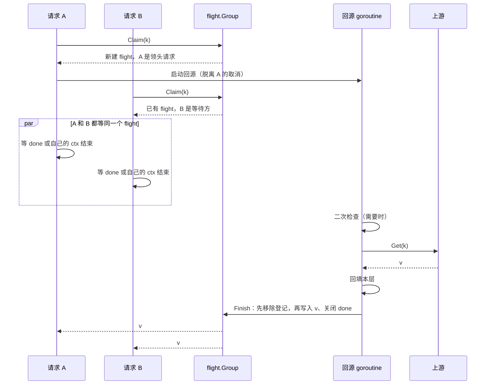
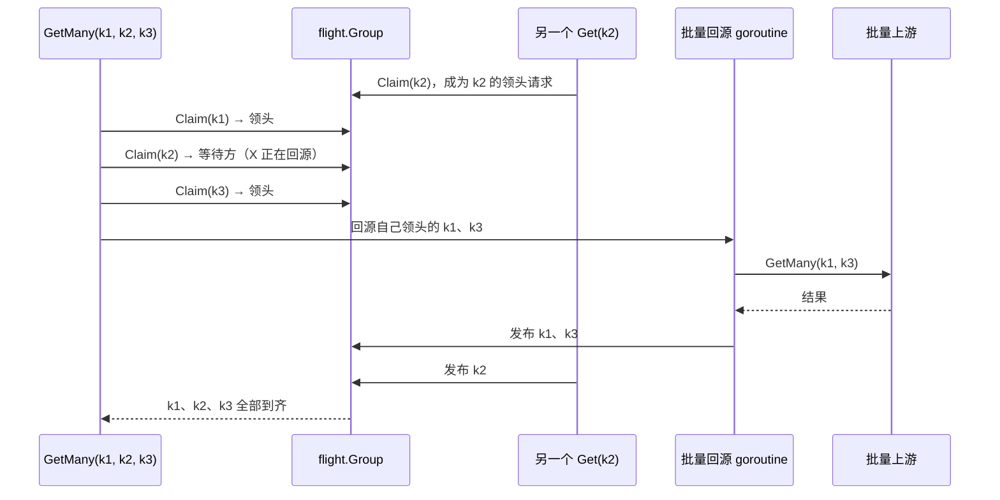

# 合并回源（singleflight）

同一个 key 的并发未命中只回源一次：第一个请求**认领**这个 key、成为**领头请求**去回源，其他请求成为**等待方**，等它**发布**结果。`Get` 和 `GetMany` 共用同一套登记，所以一个 `Get` 和一个包含同一 key 的 `GetMany` 也只回源一次。

实现分两部分，替代了 main 上使用的 `golang.org/x/sync/singleflight`（原因见 [ADR 0001](../adr/0001-own-flight-group.md)）：

- `internal/flight`：通用的登记表 `flight.Group`，只管「认领、发布、摘除」；
- `batch.go` 里的 `claimed`：cachex 自己的一层，保证每个在途回源恰好发布一次（见下文「panic 与 Goexit」）。

`internal/flight` 是内部包，暂不对外公开，以后有别的库需要时再考虑挪出去。

## 数据结构

```go
// package flight
type Flight[T any] struct {
    done  chan struct{} // 发布时关闭；对外是 Done()
    value T             // 对外是 Result()
    err   error
}

type Group[T any] struct {
    mu      sync.Mutex
    flights map[string]*Flight[T] // 回源槽位 key → 在途回源
}
```

| 操作 | 做什么 | 谁调用 |
|---|---|---|
| `Claim(sfKey)` | 有在途回源就返回它（调用方成为等待方），没有就新建并返回「你是领头请求」。**当场**给出答案，不阻塞 | 每个要回源的请求 |
| `Finish(sfKey, f, value, err)` | 先从登记中移除（只在登记的仍是这个在途回源时才移除），再写入结果、关闭 `done` | 领头请求，每个在途回源恰好一次 |
| `Drop(sfKey)` | 从登记中移除，但不发布结果、不打断回源 | `Set`/`Del`，见 [write-order.md](write-order.md#摘除在途回源) |

「只在登记的仍是这个在途回源时才移除」很重要：一个被 `Set`/`Del` 摘除的回源结束时，登记里可能已经是写入之后新建的回源，不能把它删掉（见 [write-order.md](write-order.md#摘除在途回源)）。

`Finish` **先移除、再发布**：一个请求拿到结果后立刻再来读，会发现没有在途回源，于是新建一个；这时它的二次检查会读到刚回填的值。反过来，如果先发布再移除，它就可能加入一个已经结束的回源。

## 单个 key 的时序



注意领头请求本身**不在自己的 goroutine 里回源**。回源由一个单独的 goroutine 执行，领头请求和其他等待方一样等结果。这样领头请求的 ctx 结束时，它可以立刻返回，回源仍然继续，为其他等待方服务。

## 等待方的取消

每个等待方只等两件事：`done` 关闭，或者**自己的** ctx 结束。

- ctx 先结束：返回 `context cancelled during fetch for key: …`，不影响回源本身。
- 两者同时就绪时，Go 的 `select` 会随机选一个。`GetMany` 的等待之后还会再非阻塞地检查一次 `done`：只要结果已经在了，就用结果，不会把已经到手的结果丢掉、改报取消错误。单个 `Get` 没有这一步，和 main 一样，两者同时就绪时可能返回取消错误。

## 回源用的 ctx

一次回源服务的是所有等待方，不只是领头请求。所以认领成功后，回源 goroutine 用的 ctx 是：

- **保留**领头请求 ctx 里的值（trace、日志字段等）；
- **去掉**它的取消和截止时间（`context.WithoutCancel`）：领头请求放弃了，回源仍然继续；
- **去掉**它的 GORM 事务（`WithGORMTx` 放进去的那个）：回填不能写进某一个调用方的事务里。

在这个 ctx 之上：

- 二次检查受 `WithFetchTimeout` 限制；
- 向上游取值另外受一次 `WithFetchTimeout` 限制，计时从二次检查结束后开始。

决策过程见 [ADR 0007](../adr/0007-detached-fetch-context.md)。

## panic 与 Goexit

上游可能 panic，也可能调用 `runtime.Goexit`（例如测试里在上游函数中调用 `t.FailNow`）。不管哪种情况，**每个在途回源都恰好发布一次结果**，等待方不会永远挂着：

| 上游的行为 | 等待方拿到的结果 | 日志 |
|---|---|---|
| 正常返回 | 值或错误 | — |
| panic | `panic during upstream fetch: <panic 值>` | ERROR，带 key 和调用栈 |
| `runtime.Goexit` | `upstream fetch exited without returning (runtime.Goexit)` | — |

单个 key 和批量共用同一个小结构 `claimed`：

- `publish(i, result)` 给第 i 个在途回源发布结果，重复调用无效；
- `run(ctx, idxs, body)` 执行回源，`body` panic 或调用 Goexit 时，给 `idxs` 里**还没发布的**在途回源发布错误。

批量时，二次检查已经找到值的 key 会先单独发布；之后某一段回源 panic，只影响这一段里还没发布的 key。

这一点和 `x/sync/singleflight` 不同：x/sync 在 Goexit 时，不会给 `DoChan` 的等待方发送任何结果，等待方要一直等到自己的 ctx 结束；没有截止时间的话，就永远挂着（[golang/go#52557](https://github.com/golang/go/issues/52557)）。cachex 有意偏离了这一点，见 [ADR 0006](../adr/0006-goexit-publishes-an-error.md)。

## 回源槽位

`WithFetchConcurrency(n)` 允许同一个 key 同时有 n 个在途回源。实现上，n 大于 1 时，回源槽位 key 是 `"i:key"`，`i` 是 `[0, n)` 里的随机数，每次请求随机落进一个槽位；n 为 1 时就是 key 本身。

- `n = 1`（默认）：完全合并，一个 key 同一时刻只回源一次。
- `n > 1`：请求分散到 n 个槽位，最多同时回源 n 次。代价是多打上游，好处是避免单个慢回源拖住所有请求。
- 二次检查读的是 key 本身而不是槽位 key，所以任何一个槽位先完成回填，其他槽位之后的请求都能读到它，很快收敛。
- `Set`/`Del` 摘除在途回源时，会摘掉这个 key 的**所有**槽位。

## 批量认领

`GetMany` 也走这套登记，但认领方式取决于上游是否支持批量：



- **上游支持批量**：一次性认领全部 key，把自己领头的 key 合成一次（或分段成几次）批量调用；别人正在回源的 key 就等别人的结果。认领**当场**给出答案，所以总是先发出自己的回源，再去等别人的。两个互相重叠的 `GetMany` 不会互相等待而死锁。
- **上游不支持批量**：每个 key 在轮到它时才认领，然后按单个 `Get` 的完整流程处理。这样，一个普通 `Get` 碰上某个还在 `GetMany` 队列里排队的 key 时，不需要等整个队列。

详见 [batch.md](batch.md)。

## 后台刷新的去重

返回陈旧值时发起的后台刷新，用一个 `sync.Map`（`asyncRefreshing`）按回源槽位 key 去重：同一个 key 的刷新还没结束时，不会再发起新的刷新。刷新本身也走合并回源，所以它会和同一时刻的前台回源合并。

## 使用约束

上游不能在回源时**同步**回调同一个 Client 读取同一个 key：这个 key 已经被调用方认领了，回调会等待它自己的结果，形成自锁。分层的 Client 不受影响，因为每一层都有自己的 flight.Group。
