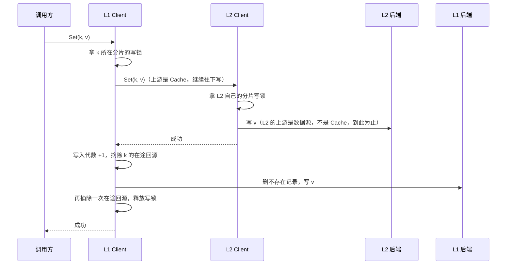
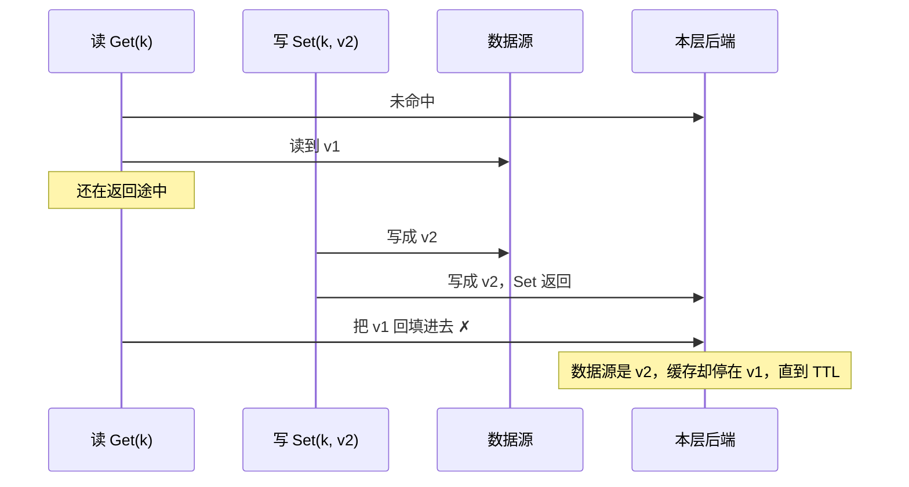
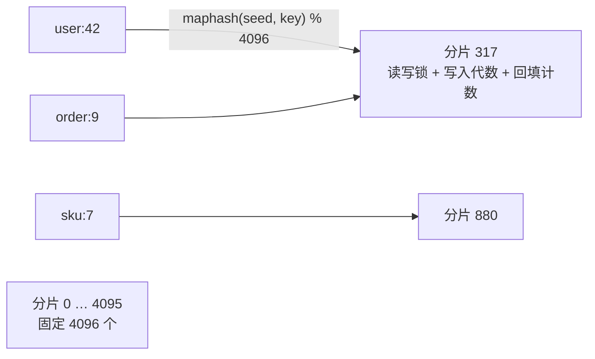
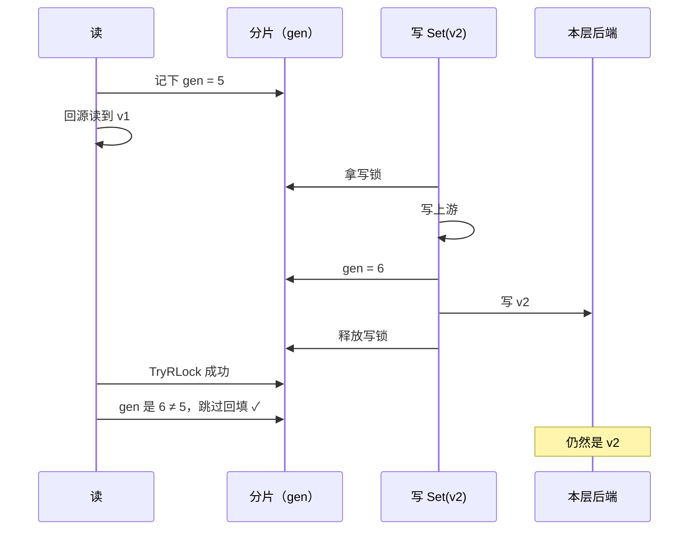
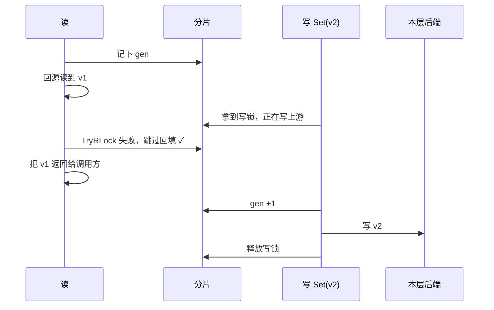
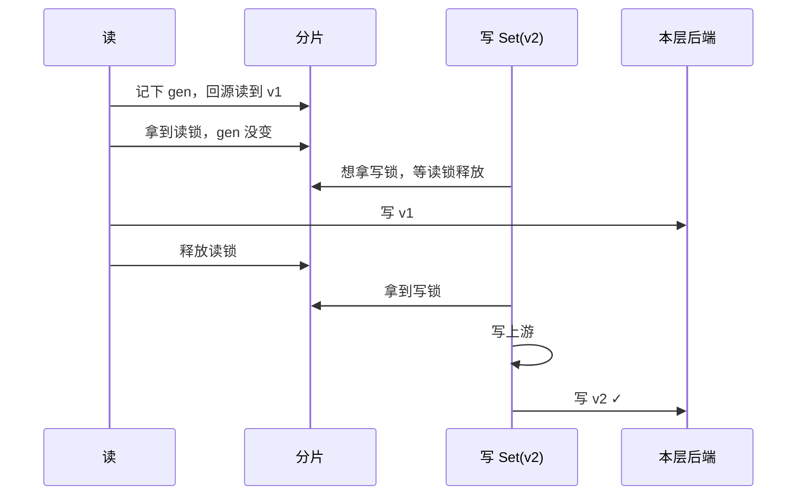
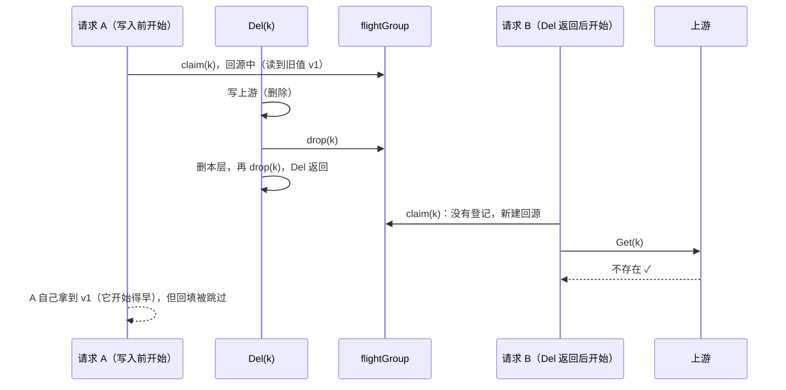
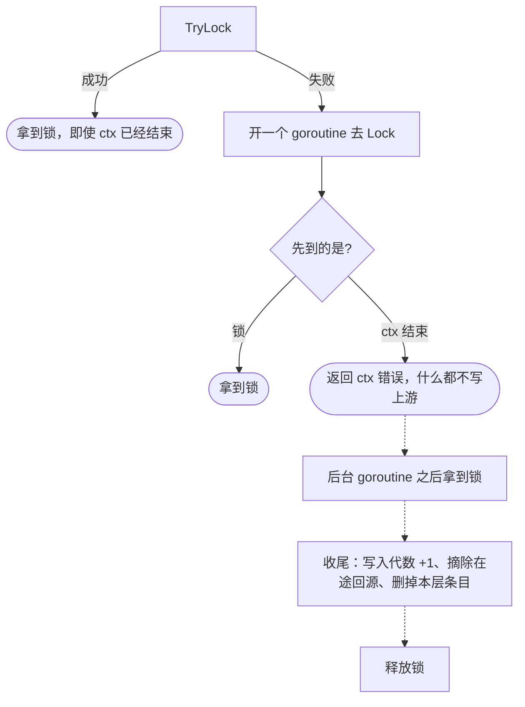

# 写入顺序与分片锁

这篇讲 `Set`/`Del` 怎么写、写入和回填之间怎么排序，以及支撑这一切的**分片锁**。代码在 `client.go`：`write`、`writeStripe`、`backfill`；批量回填在 `batch.go` 的 `doFetchMany`。

## 先说结论：对使用者意味着什么

TTL 是你**什么都不做时**，旧数据最多存活多久。`Set`/`Del` 是你**主动**要求「现在就让缓存变成新的」。这篇讲的机制保证：**这个主动要求不会被悄悄撤销**。在同一个进程里，`Set`/`Del` 一返回，之后的读取就不会再拿到写入之前的值。

没有这个保证会怎样，不是「新值早一点还是晚一点」的区别：

- **失效等于没做**：你改了价格并调用 `Del`，`Del` 也返回成功了；但一个在改价之前就读到旧价格的请求，随后把旧价格回填进缓存。于是整个 TTL 期间（可能一小时）都显示旧价格，而且没有任何报错。
- **数据倒退**：用户改完资料，刷新看到新资料，再刷新又变回旧的。
- **多层之间不一致**：L1 是新值、L2 是旧值，两层过期时间不同，读到的结果会在新旧之间来回跳。

真正在意这一点的场景：用户改完自己的数据要立刻看到；管理员封禁账号或收回权限要马上生效；价格、库存。

如果从不调用 `Set`/`Del`，这套机制几乎没有成本：没有写入就不会加写锁，回填的 `TryRLock` 永远成功。分层缓存也是如此：读取过程中的回填**不走** `Set`/`Del`。L1 未命中时调用的是 L2 Client 的 `Get`；L2 回源后直接写进 L2 的后端，L1 拿到结果后直接写进 L1 的后端，两者都只拿各自分片的读锁。

## 使用方式：改数据源时要做什么

**不需要、也拿不到分片锁**，它是库内部的。只需要遵守一个顺序：**先改数据源，再通过同一个 Client 调用 `Set` 或 `Del`**。

```go
db.Update(&product)                // ① 先改数据源
err := client.Del(ctx, product.ID) // ② 再让缓存失效（或用 client.Set 写入新值）
```

在 ① 之前就读到旧值、还在回源路上的请求，不会在 ② 返回之后把旧值回填进去；在 ① 之后才开始回源的请求，读到的本来就是新值。

顺序反过来（先 `Del`、再改数据源）就有问题：在两步之间回源的请求会读到旧值，并且**合法地**把它回填进缓存。对库来说，这次回填发生在 `Del` 之后，它无法看出这是旧值。

这个保证只在**同一个进程**内成立，见 [consistency.md](consistency.md)。

## 写入流程



- **先写上游，再写本层**：新值不会先出现在上层、而下层还没有。代价是写入过程中有一个短暂窗口：本层自己的写入落下之前，并发读本层仍会读到旧值。`Set`/`Del` 一返回，窗口就关闭了。决策过程见 [ADR 0002](../adr/0002-upstream-first-writes.md)。
- **`Set` 写本层**：删掉不存在记录，把值写进后端。
- **`Del` 写本层**：在不存在缓存里记下「不存在」，删掉后端的值。
- **写到哪一层为止**：上游是 `Cache`（比如另一个 Client）就继续往下写；上游不是 `Cache`（比如 `UpstreamFunc` 包装的数据库查询）就停下。所以 cache-aside 用法（先改数据库、再 `Set`）只会写缓存层。

### 失败时

| 失败在哪一步 | 结果 |
|---|---|
| 上游写失败 | 上游的状态未知（可能已经写进去了，只是回复丢了），所以本层**删掉**这个 key 的条目和不存在记录，返回错误。下次读会回源，读到上游的真实状态 |
| 上游写成功，本层写失败 | 返回错误，但**上游的改动保留**（不回滚）。本层删掉这个 key 的条目和不存在记录，下次读回源，读到改动后的结果 |
| 等分片锁时 ctx 结束 | 返回 ctx 错误，**不写上游**。等分片空出来后，本层的这个 key 仍会被删掉（见下文） |

一句话：**任何失败的写入，都不会在本层留下这个 key 的条目**。返回错误不代表什么都没写进去。失败后的清理用的是去掉取消的 ctx，并受 `WithFetchTimeout` 限制，因为写入失败往往正是 ctx 结束导致的。

## 要解决的竞态：旧值回填盖过新写入

读未命中时会去上游取值，取到后写进本层，这一步叫**回填**。回源需要时间，这段时间里别人可能已经 `Set` 了新值。没有任何保护时：



另一个问题是两个并发的 `Set`：在 L1 → L2 的链路里，它们写 L1 和写 L2 的先后可能不同，结果 L1 留下 A 的值、L2 留下 B 的值。

两个问题的本质一样：**同一个 key 的写入和回填需要有先后顺序**。

## 为什么不是每个 key 一把锁

最直接的想法是 `map[string]*sync.Mutex`。问题在于锁本身的生命周期：

- **内存没有上限**：缓存里有多少个 key，就有多少把锁。
- **什么时候删锁**：不能用完就删，因为另一个 goroutine 可能刚拿到这把锁的指针、正准备加锁。要安全地删，就得加引用计数，再用一把全局锁保护 map，复杂度和争用都上来了。

**分片锁**（lock striping）换了个思路：准备**固定数量**的锁，每个 key 按哈希落到其中一把上。锁的数量和 key 的数量无关，不需要创建，也不需要删除。



不同的 key 可能落到同一个分片（上图的 `user:42` 和 `order:9`）。这不影响正确性，只是它们会共用一把锁，代价见文末。

```go
const writeStripeCount = 4096

type writeStripe struct {
    mu    sync.RWMutex  // Set/Del 持写锁；回填持读锁
    gen   atomic.Uint64 // 写入代数：每次 Set/Del 加 1
    fills atomic.Uint64 // 每次回填写入本层加 1
}

func (c *Client[T]) stripe(key string) *writeStripe {
    return &c.writes[maphash.String(c.writeSeed, key)%writeStripeCount]
}
```

哈希用标准库的 `hash/maphash`，每个 Client 在创建时随机生成种子。所以同一个 key 在不同进程、不同 Client 里落到的分片一般不同，别人也没法刻意构造一批 key 全部挤进同一个分片。

## 一个分片里有什么

| 谁 | 拿什么锁 | 拿多久 | 拿不到时 |
|---|---|---|---|
| `Set`/`Del` | 写锁（独占） | 从写上游开始，到写完本层为止 | 等待；ctx 结束就放弃 |
| 回填 | 读锁（共享），用 `TryRLock` | 只在把值写进本层的那一下 | **不等，直接跳过回填** |
| 普通的读缓存 | 不拿锁 | — | — |

**读写锁**的规则是：写锁和任何锁互斥，读锁之间可以共存。所以多个回填可以同时进行，但回填和写入不会重叠。

**写入代数**（`gen`）是只增不减的计数器。每次 `Set`/`Del` 写完上游后把它加 1。回填的流程是：

```go
gen := stripe.gen.Load()        // ① 回源之前先记下写入代数
value := upstream.Get(key)      // ② 回源，可能要很久
if !stripe.mu.TryRLock() {      // ③ 有写入正在进行：不回填
    return value
}
defer stripe.mu.RUnlock()
if stripe.gen.Load() != gen {   // ④ 回源期间发生过写入：不回填
    return value
}
backend.Set(key, value)         // ⑤ 持着读锁写本层
stripe.fills.Add(1)             // ⑥ 记一次回填，二次检查会用到
return value
```

不管回不回填，读到的值都会照常返回给调用方。不回填的唯一代价是：下一次读还是未命中，要再回源一次。

**回填计数**（`fills`）只用于二次检查：写入代数加回填计数，就是**分片纪元**。默认的 `DoubleCheckAuto` 用它判断「读取之后本 Client 有没有往这一层写过东西」，见 [read-path.md](read-path.md#二次检查)。

## 三种时序，逐一检查

回填和写入只有三种相对时间关系。逐个看，它们都不会留下旧值。

### 情况 A：写入发生在回源期间，回填时写入已经结束



**靠写入代数挡住。** 这正是上面那个竞态。光有锁挡不住：回填时锁是空闲的，只有写入代数能告诉回填「你读到的值已经过时了」。

### 情况 B：回填的时候，写入正在进行



**靠锁挡住。** 此时写入代数还没变（写完上游才加 1），只看代数会放行，所以锁是必需的。用 `TryRLock` 而不是 `RLock`，是为了让读**永远不等写**：写可能要等上游好几百毫秒，读不应该被它拖住。

### 情况 C：回填先完成，写入在后



**靠先后顺序本身。** 回填完整地发生在写入之前，随后被写入覆盖。`Set` 只会等回填写本层的那一下，不会等回源。

三种情况的共同结论：**回填要么在某次写入之前落下（随后被覆盖），要么被跳过**，永远不会在 `Set`/`Del` 返回之后落下。

## 摘除在途回源

分片锁管住了回填，但还有一条路能读到旧值：**加入一次更早开始的回源**。比如请求 A 在 `Del` 之前就开始回源、读到了旧值；`Del` 返回之后请求 B 来读，本层未命中，B 通过合并回源加入 A 的回源，于是拿到了已删掉的值。

所以 `write` 在两个时间点**摘除**这个 key 的在途回源（包括所有回源槽位）：

1. **写完上游之后**：此后开始的读不会再加入之前的回源。
2. **写完本层之后**（释放写锁之前）：在「写完上游」和「写完本层」之间认领的回源，二次检查时可能读到了本层还没删掉的旧值，也要摘掉。

摘除**不打断**回源：已经在等的请求照样拿到结果（它们开始得比写入早，看到旧值是合理的）；之后来的请求找不到登记，会重新回源。被摘掉的回源自己的回填会因为写入代数变了而跳过。



## 批量回填为什么不会死锁

`GetMany` 一批可能有上千个 key，落在几百个分片上。它的回填要同时持有这些分片的读锁，然后一次 `SetMany` 写进本层。

平常同时拿多把锁必须按固定顺序拿，否则会死锁。这里不需要排序，因为 `TryRLock` **从不等待**：拿不到就跳过那个分片的 key。死锁的前提是「拿着一把锁，再等另一把」，而回填从不等待；`Set`/`Del` 只拿一把写锁，也不会「拿着一把等另一把」。

## 等写锁时尊重 ctx

`sync.RWMutex` 的 `Lock()` 没法被取消。如果前一个 `Set` 卡在上游，后面的 `Set` 就会无视自己的超时一直等下去。所以 `writeStripe.lock` 这样实现：



1. **先 `TryLock`**：分片空闲就直接拿到，即使 ctx 已经结束也照常写。这样「请求取消之后才调用 `Del` 做失效」的场景仍然有效。
2. **拿不到**，就开一个 goroutine 去 `Lock()`，自己同时等「锁到手」和「ctx 结束」。
3. **ctx 先结束**：返回错误，不写上游。那个 goroutine 继续排队，拿到锁后执行一次收尾（写入代数加 1、摘除在途回源、删掉本层这个 key 的条目），然后释放锁。

收尾这一步，是为了兑现「任何失败的写入都不留下本层条目」：`Set` 返回了错误，调用方并不确定数据处于什么状态，本层就不应该继续挂着可能过时的值。

## 慢操作会拖慢多大范围

锁只在写入时才让别人等，而且读永远不等。两类慢操作的影响范围差别很大：

| 慢的是什么 | 占着哪些分片 | 谁会被拖住 | 谁不受影响 | 最长多久 |
|---|---|---|---|---|
| **一次大 GetMany 的批量回填**（例如 1000 个 key 的 `SetMany` 写得慢） | 这批 key 涉及的**全部**分片（约 22%），读锁 | 这些分片上**任何** key 的 `Set`/`Del`，包括和这批 key 无关的 | 所有读；其他回填（读锁可以共存） | 受这批回源的超时限制 |
| 单个 key 的回填 | 1 个分片，读锁，只在写本层的那一下 | 同一分片上的 `Set`/`Del`，只等很短一下 | 其余一切 | 一次本层写入 |
| **一个慢的 `Set`/`Del`**（例如下层 Redis 卡住） | **只有 1 个分片**（1/4096），写锁 | 同一分片上其他 key 的 `Set`/`Del` 排队；同一分片上的回填被**跳过**（多一次未命中，不会等） | 所有读；其余 4095 个分片 | 受这次写入的 ctx 和下层自身的超时限制；排队的写在自己的 ctx 结束时放弃 |

「一个慢操作拖慢一大片分片」只对**批量回填**成立。如果你的场景里有很大的 `GetMany`（远超 1000 个 key），同时又有频繁的写入，可以设置 `WithGetManyChunkSize(n)`：每一段上游调用**各自**回填，只锁这一段 key 的分片，写完就释放。一万个 key、按 1000 分段时，每段只占约 22% 的分片，持锁时间也只有原来的十分之一左右。注意各段是并发执行的（最多 `WithGetManyFetchConcurrency` 段），同时回填的段会叠加；要真正限制同时占住的分片，还要一起调小 `WithGetManyFetchConcurrency`。后端的往返次数不变，因为后端本来就按 1000 个一段发送；上游调用则从 1 次变成 10 次。

注意：调小后端的 `ChunkSize` **没有**这个效果。它只决定一次 `SetMany` 拆成几条语句，而分片锁在整个 `SetMany` 期间一直被持有。批量在 1000 个 key 以内时，两种做法没有区别。

## 代价汇总

| 项目 | 数值 | 说明 |
|---|---|---|
| 内存 | 160 KB / Client | 每个分片 40 字节（读写锁 24 + 两个计数器各 8）× 4096，直接内嵌在 Client 结构体里，不需要额外分配 |
| 两个指定的 key 撞进同一分片 | 1 / 4096 | 撞上后：它们的写入互相排队；一个 key 的写入可能让另一个 key 的回填被跳过（多一次未命中） |
| 一次 1000 个 key 的 GetMany 覆盖的分片 | 约 22% | 1 − (4095/4096)^1000；一万个 key 时约 91% |
| 读路径 | 无等待 | 读缓存不拿锁；回填只用 `TryRLock`，拿不到就跳过 |

撞分片的代价只体现在延迟和偶尔多一次未命中上，**永远不会读到错的值**。分片数从最初的 1024 调到了 4096：碰撞少到四分之一，内存从 32KB 增加到 160KB。决策过程见 [ADR 0003](../adr/0003-striped-backfill-guard.md)。

## 使用约束

上游是 `Cache` 时，它的 `Set`/`Del` 不能同步回调同一个 Client、写同一个分片上的任何 key（不只是同一个 key）：调用方正持有这个分片的写锁，回调会一直等到自己的 ctx 结束。分层的 Client 不受影响，因为每一层都有自己的分片。
