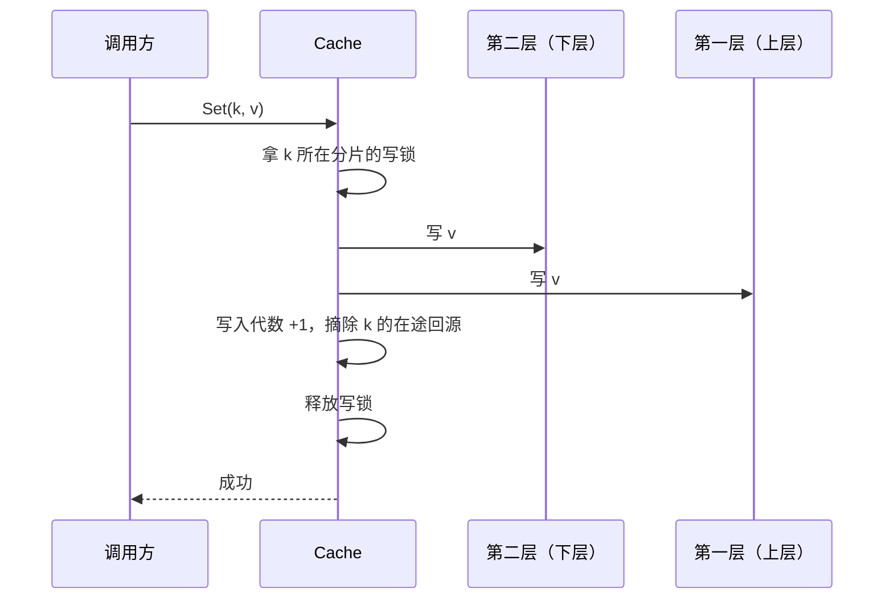
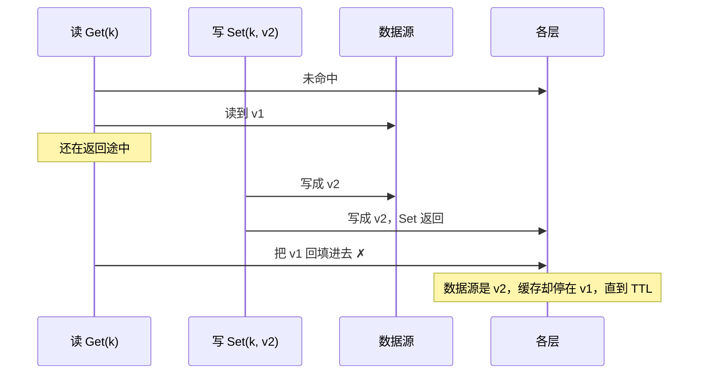
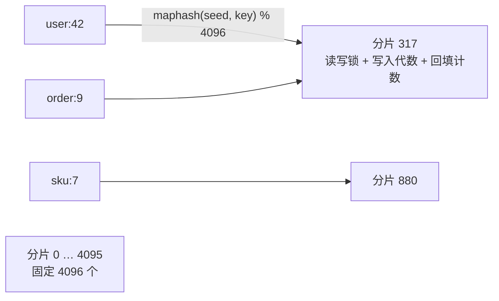
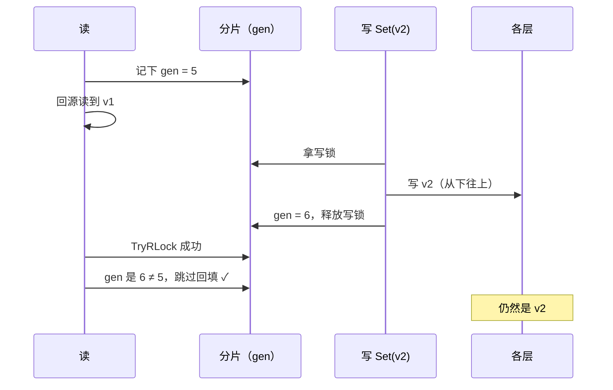
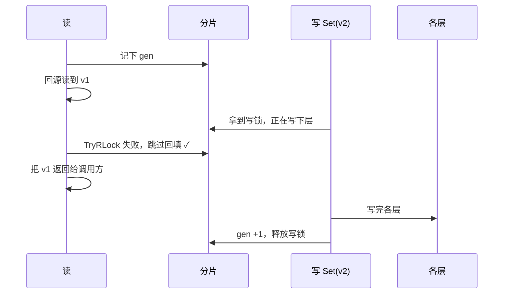
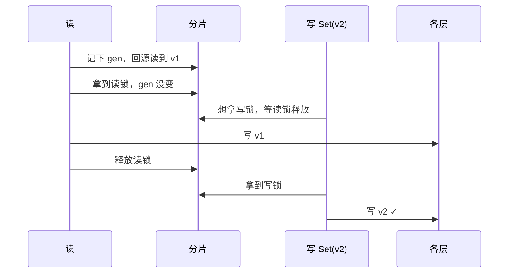
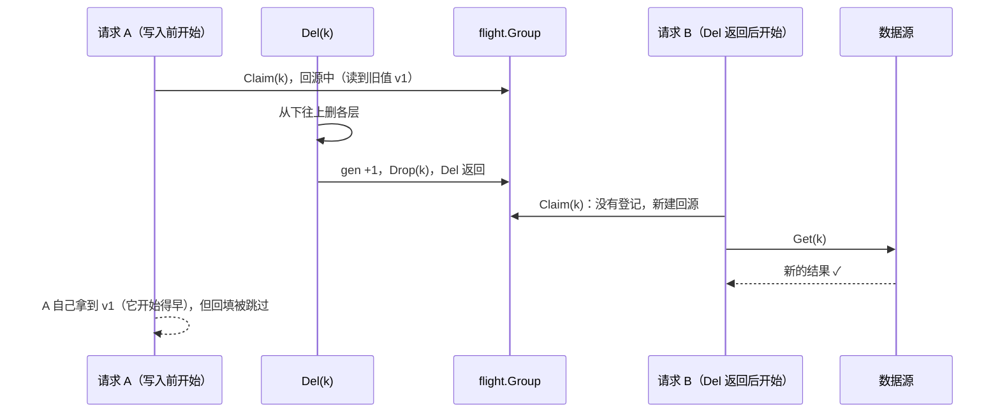
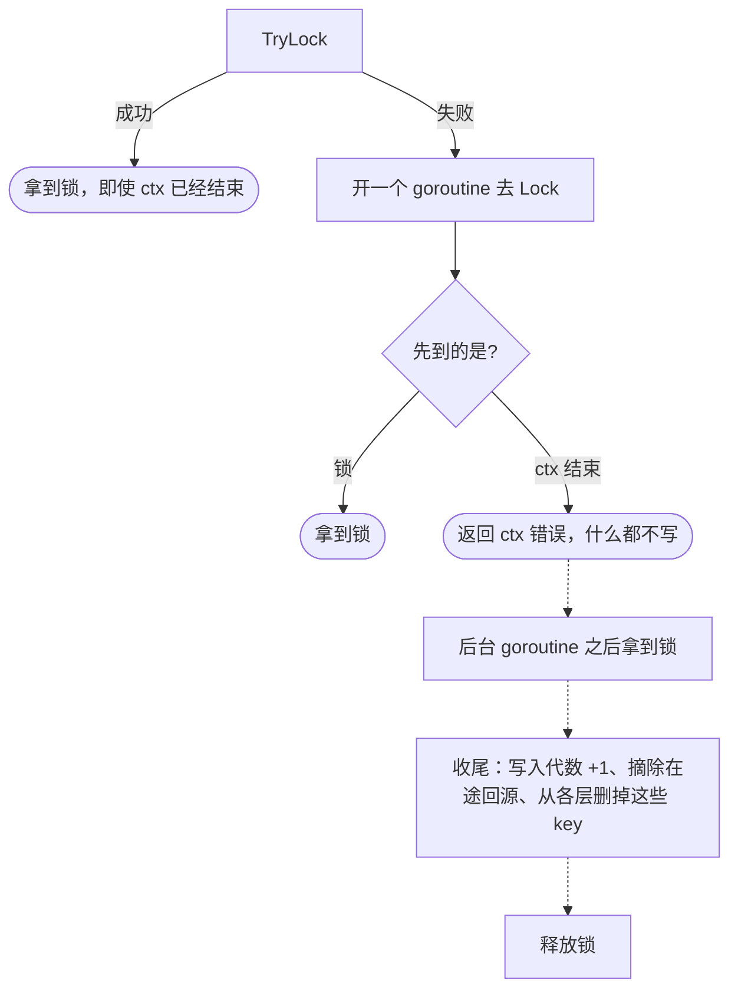

# 写入顺序与分片锁

这篇讲 `Set`/`Del`/`SetMany`/`DelMany` 怎么写、写入和回填之间怎么排序，以及支撑这一切的**分片锁**。分片本身在内部包 `internal/stripe`（`stripe.Set`、`stripe.Stripe`）；写入在 `write.go` 的 `writeOne`、`write`，回填在 `read.go` 的 `backfill`、`backfillOne`。

## 先说结论：对使用者意味着什么

TTL 是你**什么都不做时**，旧数据最多存活多久。写入是你**主动**要求「现在就让缓存变成新的」。这篇讲的机制保证：**这个主动要求不会被悄悄撤销**。在同一个进程里，写入一返回，之后的读取就不会再拿到写入之前的值。

没有这个保证会怎样，不是「新值早一点还是晚一点」的区别：

- **失效等于没做**：你改了价格并调用 `Del`，`Del` 也返回成功了；但一个在改价之前就读到旧价格的请求，随后把旧价格回填进缓存。于是整个 TTL 期间（可能一小时）都显示旧价格，而且没有任何报错。
- **数据倒退**：用户改完资料，刷新看到新资料，再刷新又变回旧的。
- **层与层之间不一致**：第一层是新值、第二层是旧值，两层过期时间不同，读到的结果会在新旧之间来回跳。

真正在意这一点的场景：用户改完自己的数据要立刻看到；管理员封禁账号或收回权限要马上生效；价格、库存。

如果从不写入，这套机制几乎没有成本：没有写入就不会加写锁，回填的 `TryRLock` 永远成功。读取中的回填**不走**写入，它直接写各层的后端，只拿分片读锁。

## 使用方式：改数据源时要做什么

**不需要、也拿不到分片锁**，它是库内部的。只需要遵守一个顺序：**先改数据源，再通过同一个 `Cache` 调用 `Set` 或 `Del`**。

```go
db.Update(&product)                // ① 先改数据源
err := cache.Del(ctx, product.ID)  // ② 再让缓存失效（或用 cache.Set 写入新值）
```

在 ① 之前就读到旧值、还在回源路上的请求，不会在 ② 返回之后把旧值回填进去；在 ① 之后才开始回源的请求，读到的本来就是新值。

顺序反过来（先 `Del`、再改数据源）就有问题：在两步之间回源的请求会读到旧值，并且**合法地**把它回填进缓存。对库来说，这次回填发生在 `Del` 之后，它无法看出这是旧值。

写入**从不写数据源**，只写各层。这个保证只在**同一个进程**内成立，见 [consistency.md](consistency.md)。

## 写入流程



- **先写下层，再写上层**：新值不会先出现在上层、而下层还没有。代价是写入过程中有一个短暂窗口：上层落下之前，并发读仍会读到旧值。写入一返回，窗口就关闭了。决策过程见 [ADR 0002](../adr/0002-upstream-first-writes.md)。
- **`Set`**：按「数据源刚回答了这个值」计算每层的条目（`CachedAt` 是现在，各层自己的 TTL 和抖动，受 `WithMaxAge` 约束），写进各层。算出来已经腐烂的（寿命上限为 0）就删掉。
- **`Del`**：从各层删掉这个 key，**不记录不存在**。下次读取问数据源，数据源说不存在，才会记下。这样「先更新数据源、再 `Del` 失效」不会让更新过的 key 读成不存在。
- **用调用方的 ctx 写**：写入属于调用方，所以 `gormcachex.WithTx` 放进来的事务会生效。失败后的失效例外，见下文。
- `SetMany`/`DelMany` 每层一次批量调用；单个 key 的 `Set`/`Del` 走一条不建 map 的快路径，语义相同。

### 失败时

| 失败在哪一步 | 结果 |
|---|---|
| 第 j 层写失败（下层已写好） | 第 j 层的状态未知（可能已经写进去了，只是回复丢了），所以**删掉**第 j 层和它上面所有层的这个 key，返回错误。下层保留已写的新值，不回滚 |
| 批量写入里某些 key 在第 j 层失败 | 只有这些 key 按上面处理，列在 `*BatchError` 里，其余 key 照常写完 |
| 等分片锁时 ctx 结束 | 返回 ctx 错误，什么都不写。等分片空出来后，各层的这些 key 仍会被删掉（见下文） |

一句话：**任何失败的写入，都不会在失败的那一层及其上面留下这个 key 的条目**。返回错误不代表什么都没写进去。失效用的是共享 ctx（去掉取消和调用方的事务，见 [singleflight.md](singleflight.md#回源用的-ctx)），并受 `WithFetchTimeout` 限制，因为写入失败往往正是 ctx 结束导致的，而调用方的事务也可能随后回滚。失效失败只记 WARN 日志：一层既然删不掉，紧接着的失效同样删不掉。

## 要解决的竞态：旧值回填盖过新写入

读未命中时会往下取值，取到后写进上面的层，这一步叫**回填**。回源需要时间，这段时间里别人可能已经 `Set` 了新值。没有任何保护时：



另一个问题是两个并发的 `Set`：它们写第二层和写第一层的先后可能不同，结果第一层留下 A 的值、第二层留下 B 的值。

两个问题的本质一样：**同一个 key 的写入和回填需要有先后顺序**。

## 为什么不是每个 key 一把锁

最直接的想法是 `map[string]*sync.Mutex`。问题在于锁本身的生命周期：

- **内存没有上限**：缓存里有多少个 key，就有多少把锁。
- **什么时候删锁**：不能用完就删，因为另一个 goroutine 可能刚拿到这把锁的指针、正准备加锁。要安全地删，就得加引用计数，再用一把全局锁保护 map，复杂度和争用都上来了。

**分片锁**（lock striping）换了个思路：准备**固定数量**的锁，每个 key 按哈希落到其中一把上。锁的数量和 key 的数量无关，不需要创建，也不需要删除。一个 `Cache` 只有一套分片，覆盖它的所有层。



不同的 key 可能落到同一个分片（上图的 `user:42` 和 `order:9`）。这不影响正确性，只是它们会共用一把锁，代价见文末。

```go
// package stripe
const Count = 4096

type Stripe struct {
    mu    sync.RWMutex  // 写入持写锁；回填持读锁
    gen   atomic.Uint64 // 写入代数：每次写入加 1
    fills atomic.Uint64 // 每次回填加 1
}

type Set struct {
    seed    maphash.Seed
    stripes [Count]Stripe
}

func (s *Set) Index(key string) int  { return int(maphash.String(s.seed, key) % Count) }
func (s *Set) For(key string) *Stripe { return &s.stripes[s.Index(key)] }
```

哈希用标准库的 `hash/maphash`，每个 `Cache` 在创建时随机生成种子。所以同一个 key 在不同进程、不同 `Cache` 里落到的分片一般不同，别人也没法刻意构造一批 key 全部挤进同一个分片。

## 一个分片里有什么

| 谁 | 拿什么锁 | 拿多久 | 拿不到时 |
|---|---|---|---|
| 写入 | 写锁（独占） | 从写最下层开始，到写完最上层为止 | 等待；ctx 结束就放弃 |
| 回填 | 读锁（共享），用 `TryRLock` | 只在把结果写进各层的那一下 | **不等，直接跳过回填** |
| 普通的读 | 不拿锁 | — | — |

**读写锁**的规则是：写锁和任何锁互斥，读锁之间可以共存。所以多个回填可以同时进行，但回填和写入不会重叠。

**写入代数**（`gen`）是只增不减的计数器。每次写入写完各层后、释放写锁前把它加 1。回填的流程是：

```go
gen := stripe.Generation()      // ① 读下层、问数据源之前先记下写入代数
value := readBelowOrSource(key) // ② 可能要很久
if !stripe.TryRLock() {         // ③ 有写入正在进行：不回填
    return value
}
defer stripe.RUnlock()
if stripe.Generation() != gen { // ④ 回源期间发生过写入：不回填
    return value
}
writeLayersAbove(key, value)    // ⑤ 持着读锁，从下往上写
stripe.AddFill()                // ⑥ 记一次回填，二次检查会用到
return value
```

不管回不回填，读到的值都会照常返回给调用方。不回填的唯一代价是：下一次读还是未命中，要再回源一次。

**回填计数**（`fills`）只用于二次检查：写入代数加回填计数，就是**分片纪元**。默认的 `DoubleCheckAuto` 用它判断「读取之后本 `Cache` 有没有写过」，见 [read-path.md](read-path.md#二次检查)。

## 三种时序，逐一检查

回填和写入只有三种相对时间关系。逐个看，它们都不会留下旧值。

### 情况 A：写入发生在回源期间，回填时写入已经结束



**靠写入代数挡住。** 这正是上面那个竞态。光有锁挡不住：回填时锁是空闲的，只有写入代数能告诉回填「你读到的值已经过时了」。

### 情况 B：回填的时候，写入正在进行



**靠锁挡住。** 此时写入代数还没变（写完各层才加 1），只看代数会放行，所以锁是必需的。用 `TryRLock` 而不是 `RLock`，是为了让读**永远不等写**：写可能要等远程的层好几百毫秒，读不应该被它拖住。

### 情况 C：回填先完成，写入在后



**靠先后顺序本身。** 回填完整地发生在写入之前，随后被写入覆盖。写入只会等回填写各层的那一下，不会等回源。

三种情况的共同结论：**回填要么在某次写入之前落下（随后被覆盖），要么被跳过**，永远不会在写入返回之后落下。

## 摘除在途回源

分片锁管住了回填，但还有一条路能读到旧值：**加入一次更早开始的回源**。比如请求 A 在 `Del` 之前就开始回源、读到了旧值；`Del` 返回之后请求 B 来读，第一层未命中，B 通过合并回源加入 A 的回源，于是拿到了已删掉的值。

所以写入在写完各层之后、释放写锁之前，**摘除**这个 key 的在途回源（包括所有份，见 [singleflight.md](singleflight.md#每个-key-的回源数)）。写入失败时也一样摘除。

摘除**不打断**回源：已经在等的请求照样拿到结果（它们开始得比写入早，看到旧值是合理的）；之后来的请求找不到登记，会重新回源。被摘掉的回源自己的回填会因为写入代数变了而跳过。



## 批量为什么不会死锁

**批量回填**一批可能有上千个 key，落在几百个分片上。它要同时持有这些分片的读锁，再每层一次 `SetMany`。这里不需要排序，因为 `TryRLock` **从不等待**：拿不到就跳过那个分片的 key。死锁的前提是「拿着一把锁，再等另一把」，而回填从不等待。

**批量写入**（`SetMany`/`DelMany`）要拿多把写锁，而写锁要等。所以所有写入都按**分片编号从小到大**加锁（`stripe.Set.Index`），同一个分片只拿一次。两个重叠的批量写入总是按同一个顺序拿锁，谁先拿到小编号的分片，谁就先走，不会互相等待。

## 等写锁时尊重 ctx

`sync.RWMutex` 的 `Lock()` 没法被取消。如果前一个写入卡在远程的层，后面的写入就会无视自己的超时一直等下去。所以 `stripe.Stripe.Lock` 这样实现：



1. **先 `TryLock`**：分片空闲就直接拿到，即使 ctx 已经结束也照常写。这样「请求取消之后才调用 `Del` 做失效」的场景仍然有效。
2. **拿不到**，就开一个 goroutine 去 `Lock()`，自己同时等「锁到手」和「ctx 结束」。
3. **ctx 先结束**：返回错误，什么都不写。那个 goroutine 继续排队，拿到锁后执行一次收尾，然后释放锁。

收尾这一步，是为了兑现「任何失败的写入都不留下条目」：写入返回了错误，但调用方可能已经改了数据源，缓存就不应该继续挂着可能过时的值。

批量写入在等某个分片时放弃：已经拿到的分片立即收尾并释放；正在等的那个由后台收尾；还没轮到的分片也各自安排收尾（空闲就当场做，否则排队做）。

## 慢操作会拖慢多大范围

锁只在写入时才让别人等，而且读永远不等。两类慢操作的影响范围差别很大：

| 慢的是什么 | 占着哪些分片 | 谁会被拖住 | 谁不受影响 | 最长多久 |
|---|---|---|---|---|
| **一次大 GetMany 的批量回填**（例如 1000 个 key 的 `SetMany` 写得慢） | 这批 key 涉及的**全部**分片（约 22%），读锁 | 这些分片上**任何** key 的写入，包括和这批 key 无关的 | 所有读；其他回填（读锁可以共存） | 受这次调用的超时限制 |
| 单个 key 的回填 | 1 个分片，读锁，只在写各层的那一下 | 同一分片上的写入，只等很短一下 | 其余一切 | 一次各层写入 |
| **一个慢的 `Set`/`Del`**（例如 Redis 卡住） | **只有 1 个分片**（1/4096），写锁 | 同一分片上其他 key 的写入排队；同一分片上的回填被**跳过**（多一次未命中，不会等） | 所有读；其余 4095 个分片 | 受这次写入的 ctx 和后端自身的超时限制；排队的写在自己的 ctx 结束时放弃 |

「一个慢操作拖慢一大片分片」只对**批量回填**成立。如果你的场景里有很大的 `GetMany`（远超 1000 个 key），同时又有频繁的写入，可以设置 `WithGetManyChunkSize(n)`：数据源的每一段调用**各自**回填，只锁这一段 key 的分片，写完就释放。注意各段是并发执行的（最多 `WithGetManyConcurrency` 段），同时回填的段会叠加；要真正限制同时占住的分片，还要一起调小 `WithGetManyConcurrency`。下层命中的 key 不分段，在读那一层之后一起回填。

调小后端的 `ChunkSize` **没有**这个效果：它只决定一次 `SetMany` 拆成几条语句或几个 pipeline，而分片锁在整个回填期间一直被持有。

## 代价汇总

| 项目 | 数值 | 说明 |
|---|---|---|
| 内存 | 160 KB / `Cache` | 每个分片 40 字节（读写锁 24 + 两个计数器各 8）× 4096，`New` 时单独分配一次 |
| 两个指定的 key 撞进同一分片 | 1 / 4096 | 撞上后：它们的写入互相排队；一个 key 的写入可能让另一个 key 的回填被跳过（多一次未命中） |
| 一次 1000 个 key 的 GetMany 覆盖的分片 | 约 22% | 1 − (4095/4096)^1000；一万个 key 时约 91% |
| 读路径 | 无等待 | 读不拿锁；回填只用 `TryRLock`，拿不到就跳过 |

撞分片的代价只体现在延迟和偶尔多一次未命中上，**永远不会读到错的值**。决策过程见 [ADR 0003](../adr/0003-striped-backfill-guard.md)。

## 使用约束

后端的 `Set`/`Del` 不能同步回调同一个 `Cache`、写同一个分片上的任何 key（不只是同一个 key）：调用方正持有这个分片的写锁，回调会一直等到自己的 ctx 结束。
